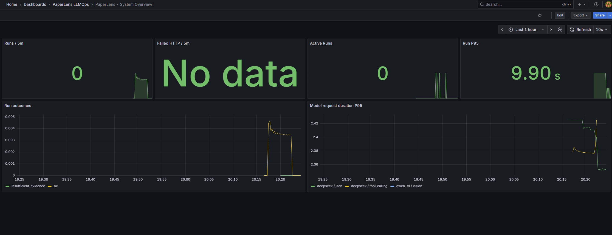

这三张图分别监控系统、Agent/Tool、模型与记忆。你当前的数据显示整个观测链路已经正常。

### 1. System Overview：系统整体运行情况

这是第三张图。

- `Runs / 5m = 0`
  - 表示最近5分钟没有新的问答。
  - 你之前的4次问答已经超过当前5分钟窗口，所以当前显示0。
  - 右侧的小曲线说明此前确实有运行记录。

- `Failed HTTP / 5m = No data`
  - 最近没有HTTP 5xx服务器错误。
  - 这里的 `No data` 基本是好现象，不是系统故障。

- `Active Runs = 0`
  - 当前没有正在执行的问答任务，正常。
  - 提问正在执行时会短暂变成1。

- `Run P95 = 9.90s`
  - 问答端到端耗时的95分位约为9.9秒。
  - 可理解为大部分请求耗时不超过约9.9秒。
  - 当前只有少量样本，只用于工程观察，不能当作稳定性能结论。

- `Run outcomes`
  - `ok`：正常回答。
  - `insufficient_evidence`：论文证据不足而拒答。
  - 说明第四个不可回答问题被系统正确识别。

- `Model request duration P95`
  - 展示 DeepSeek普通 JSON 生成、Function Calling、Qwen‑VL视觉调用的P95耗时。
  - 当前 DeepSeek单次模型请求大约在2.35～2.43秒。

### 2. Agents & Tools：Agent和工具运行情况

这是第一张图。

- `Tool calls by status`
  - 显示调用了哪些工具以及结果状态。
  - 你的图中已经出现：
    - `search_text`
    - `search_tables`
    - `read_table`
    - `search_figures`
    - `read_figure`
    - `analyze_figure_for_query`
  - `success` 表示成功，`partial` 表示工具执行完成但证据不足。
  - 曲线接近0是因为当前显示的是“每秒调用速率”，而你的调用次数较少。

- `LangGraph node P95`
  - 展示各个LangGraph节点的P95耗时。
  - `supervisor_plan`：规划和任务分派。
  - `evidence_critic`：证据审核。
  - `answer_agent`：生成并校验最终答案。
  - 当前 `answer_agent` 耗时最长，约4.8秒，符合预期。

- `Function fallback / 1h = No data`
  - 最近没有Function Calling失败后回退到固定流程。
  - 这是正常结果。

- `Rejected tool calls / 1h = No data`
  - 模型没有生成非法、越权或参数错误的工具调用。
  - 也是正常结果。

- `Circuit State = 0`
  - Function Calling熔断器处于关闭状态。
  - `0`代表正常；`1`才代表连续失败后触发熔断。

### 3. Models & Memory：模型消耗和长期记忆

这是第二张图。

- `Tokens / 5m`
  - 表示每5分钟使用的Token数量。
  - `deepseek / json`：普通结构化生成。
  - `deepseek / tool_calling`：Function Calling规划。
  - `qwen-vl / vision`：视觉分析。
  - 这是Token数量，不是费用。

- `Model requests`
  - 展示各模型的请求速率。
  - 你的 DeepSeek和Qwen‑VL都已有成功记录。
  - 曲线下降表示测试结束后没有继续产生请求。

- `Memory items by lifecycle`
  - `active = 9`：9条有引用、已验证的可靠记忆。
  - `unresolved = 9`：9条拒答、partial或缺少引用的未解决记录。
  - `stale = 0`：没有因为论文重新解析而失效的记忆。
  - `archived = 0`：没有因过期或容量淘汰归档的记忆。
  - `forgotten = 0`：没有用户主动忘记的记忆。

这里的9条是当前本地数据库的全局数量，包含历史Run回填，不只是刚刚测试的4个问题。

- `Memory operations`
  - `backfill / success`：从旧Run回填记忆。
  - `write / active`：写入可靠记忆。
  - `write / unresolved`：写入待解决记忆。

总体结论：三个Dashboard都正常。文本、表格、Figure、拒答、DeepSeek、Qwen‑VL、LangGraph、Function Calling、Prometheus、Tempo和长期记忆均已产生真实观测数据。`No data`的两个位置表示没有发生失败或非法调用，不是异常。