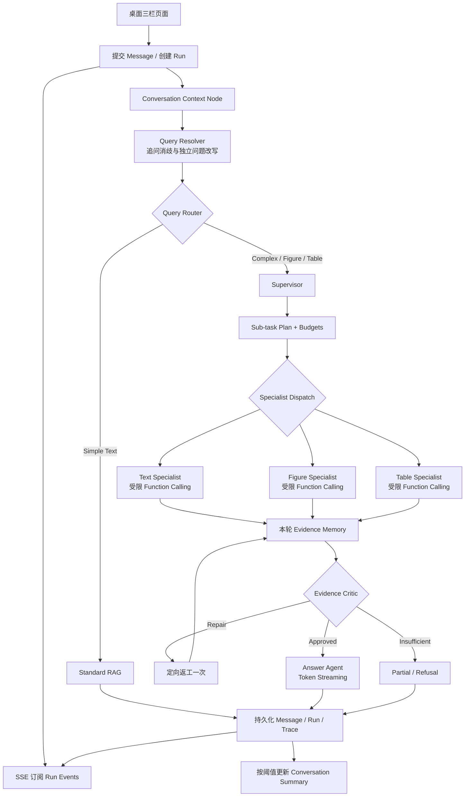
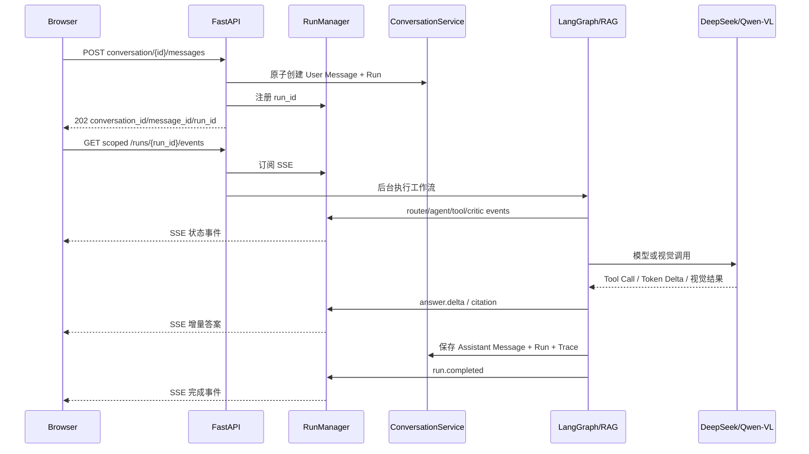

# PaperLens 对话式多智能体升级技术方案

> 文档状态：待审核，尚未开始实施  
> 目标版本：PaperLens 5.0（建议版本号）  
> 适用目录：`D:\Desktop\job\demo`  
> 基线：当前已完成的 LangGraph 多智能体、多模态 RAG、20 条冻结 v2 Benchmark 及现有测试  
> 本轮范围：桌面三栏会话、上下文与 Memory、Specialist Function Calling、SSE 流式输出、数据库与回归测试  
> 明确不做：正式评测集扩容、MCP、Redis、PostgreSQL、移动端、用户画像、跨论文对话、增加更多 Agent

---

## 0. 审核结论栏

实施前需要确认以下决策。审核通过后按本文阶段顺序推进，每个阶段完成后先验收再进入下一阶段。

- [ ] 保留当前 Standard RAG 与 LangGraph 多智能体两条业务链路。
- [ ] Conversation 一次只绑定一篇论文，不支持跨论文共享上下文。
- [ ] 业务数据继续使用 `data/paperlens.sqlite3`，不引入 PostgreSQL。
- [ ] SSE 首期使用单进程内存事件缓冲，不引入 Redis。
- [ ] Specialist Function Calling 使用特性开关上线，固定流程保留为回退与对照。
- [ ] 本轮不扩充正式评测集，只增加必要的多轮功能测试和少量固定 Smoke Case。
- [ ] 冻结 Test 8 条只在所有功能和 Dev 修复完成后运行一次。
- [ ] MCP 不属于本轮升级范围。

---

## 1. 背景与当前基线

当前 PaperLens 已具备以下稳定能力：

- Docling + PyMuPDF 论文解析、章节对齐、句子级 BBox 和 PDF 定位；
- Text、Figure、Table 三类统一 Evidence；
- BM25、BGE-M3、Qdrant、RRF、BGE Reranker 混合检索；
- Qwen-VL Figure 原图理解、查询缓存、低分辨率放大和独立 Visual Judge；
- Table Markdown 结构化读取与可选 VLM fallback；
- Standard RAG 简单事实快速路径；
- LangGraph Supervisor、Text/Figure/Table Specialist、Evidence Critic、Answer Agent；
- 工具/模型/Qwen-VL 预算、超时、有限返工、Checkpoint、Trace 和故障恢复；
- SQLite 论文数据、独立 LangGraph Checkpoint SQLite、本地或远程 Qdrant；
- 5 篇论文、20 条冻结 v2 Benchmark（Dev 12 / Test 8）及 30 条 v3 扩展集合。

当前主要业务缺口：

1. `/ask` 只有单轮 `question`，没有 Conversation、消息时间线和跨轮上下文。
2. `qa_history` 只保存结果，下一轮不会读取，因此不是对话 Memory。
3. LangGraph 每次使用新 `run_id` 作为 `thread_id`，只承担单轮执行状态，不承担语义记忆。
4. Specialist 以固定 Python 流程调用工具，属于 Tool Use，但不是模型原生 Function Calling。
5. 前端只适合一次提问与一次性结果展示，缺少历史会话和当前消息窗口。
6. 长耗时问答缺少实时状态与 Token 输出，用户难以区分“运行中”和“卡住”。

本次升级只改造交互、会话、编排和模型调用层，不重新设计论文解析与检索底座。

---

## 2. 升级目标与非目标

### 2.1 核心目标

1. 建立持久化 Conversation 和 Message，支持创建、切换、重命名、归档和继续对话。
2. 使用最近消息、历史摘要和已引用实体解析“它、上一个、刚才那张图”等追问。
3. 所有追问先改写为独立检索问题，再进入 Router、检索和多智能体工作流。
4. 历史消息只用于理解语境，论文事实仍必须由本轮 Evidence 支持。
5. 保留当前多智能体分工，为三个 Specialist 增加受限 Function Calling。
6. 使用 SSE 推送工作流状态、工具调用、引用、最终答案 Token、完成与错误事件。
7. 页面改成“历史对话 / 阅读卡片 / 当前聊天”桌面三栏工作台。
8. 保持当前单轮功能、冻结 Dev/Test 质量、引用契约和故障恢复能力不回归。

### 2.2 非目标

本轮不实现：

- MCP Server 或 MCP Client；
- PostgreSQL、Redis、Kafka、Celery 或多实例部署；
- 移动端适配；
- 用户登录、RBAC、多租户；
- 跨论文会话和跨论文检索；
- 对全部历史消息建立向量索引；
- 用户画像、偏好学习或永久个人记忆；
- 无限制自主 Agent 循环；
- 新增 Agent 角色；
- 正式 Benchmark 扩充到更多论文或 60～100 条问题；
- 修改 Docling/PyMuPDF 解析、现有 Qdrant 数据格式或重新分析全部论文。

---

## 3. 关键设计原则

### 3.1 历史不是证据

- Conversation Memory 只解决指代、上下文连续性和用户意图。
- 历史 Assistant 回答不能直接进入最终 Claim 的证据集合。
- 上一轮 Evidence ID 可以作为检索提示，但必须在本轮重新读取并加入本轮 Evidence Memory。
- Evidence Critic 必须拒绝仅由历史回答支持、没有当前论文 Evidence 的 Claim。

### 3.2 Conversation 与 Run 分离

- `conversation_id`：一段可以长期继续的语义对话。
- `turn_index`：Conversation 中的轮次序号。
- `run_id`：一次具体问答工作流执行。
- `thread_id`：LangGraph 单轮 Checkpoint 标识，使用 `conversation_id:turn_index`。

不得直接使用固定 `conversation_id` 作为所有轮次的 LangGraph `thread_id`，否则上一轮 Plan、Evidence、预算和错误可能污染下一轮。

### 3.3 一个 Conversation 只绑定一篇论文

- Conversation 创建时写入 `paper_id`，之后不可修改。
- API 必须同时校验 `paper_id`、`conversation_id` 和 `run_id` 的所属关系。
- 切换论文时必须创建或选择目标论文下的 Conversation。

### 3.4 受限 Function Calling

- 每个 Specialist 只能看到自己的工具白名单。
- 模型不能生成代码、SQL、文件路径或任意函数名并执行。
- 工具参数必须通过 Pydantic/JSON Schema 校验。
- 工具调用次数、模型调用次数、Qwen-VL 次数、总时限继续受现有预算约束。
- 相同工具与相同参数不得重复调用。
- Function Calling 失败时允许回退到当前固定流程，并在 Trace 中明确标记。

### 3.5 渐进式兼容

- 不立即删除 `/api/papers/{paper_id}/ask`。
- 不立即删除固定 Specialist 流程和 Legacy Executor。
- 所有新能力通过配置开关启用，可快速回滚。
- 数据库只增量建表和增加索引，不删除现有表或记录。

---

## 4. 目标总体架构



### 4.1 请求时序



---

## 5. 桌面端页面设计

### 5.1 三栏布局

```text
┌────────────────────────────────────────────────────────────────────────────┐
│ PaperLens │ 当前论文 │ 解析状态 │ 重新分析 │ 设置                         │
├──────────────┬────────────────────────┬────────────────────────────────────┤
│ 历史对话     │ 阅读卡片               │ 当前聊天窗口                       │
│ 240～280px   │ 380～460px             │ min 600px / 剩余空间                │
│              │                        │                                    │
│ + 新建对话   │ 基本信息               │ 对话标题 / 上下文状态 / 操作         │
│ 搜索         │ 研究问题               │                                    │
│ 今天/昨天    │ 方法概述               │ Message Timeline                   │
│ 会话标题     │ 实验结果               │ Answer + Citations                 │
│ 摘要/时间    │ 贡献与局限             │ 折叠 Trace                          │
│              │ Figure/Table 概览      │                                    │
│ 独立滚动     │ 独立滚动               │ 固定 Composer / 停止 / 发送          │
└──────────────┴────────────────────────┴────────────────────────────────────┘
```

建议 CSS：

```css
.workspace {
  display: grid;
  grid-template-columns: 260px minmax(380px, 440px) minmax(600px, 1fr);
  height: calc(100vh - 64px);
}
```

### 5.2 历史对话栏

必须支持：

- 创建新对话；
- 加载当前论文下未归档会话；
- 按今天、昨天、更早分组；
- 对话标题、最后消息摘要、更新时间；
- 搜索、重命名、软删除/归档；
- 当前选中状态；
- 一个 Conversation 最多一个活动 Run，重复提交返回 `409`。

点击历史会话后，在第三栏加载完整消息，不额外打开旧消息窗口。

### 5.3 阅读卡片栏

保留当前阅读卡片能力，改为独立滚动和折叠章节：

- 基本信息、研究问题、方法、实验、结果、贡献、局限；
- Figure/Table 概览；
- Citation 定位原始 PDF；
- “针对这段内容提问”将 Evidence ID 和建议问题填入 Composer；
- Chat 引用命中卡片内容时，卡片可以展开并短暂高亮。

### 5.4 当前聊天栏

- Header：会话标题、当前论文、上下文轮数、重命名/归档/导出；
- Message Timeline：用户与 Assistant 消息、时间、状态；
- Assistant Message：增量答案、引用、回答状态、折叠 Agent Trace；
- Composer：固定底部，多行输入，`Enter` 发送、`Shift+Enter` 换行；
- 运行中显示停止按钮并禁止同一 Conversation 再提交；
- SSE 断线时显示重连状态，最终状态可通过 Run 查询接口恢复；
- 不展示模型隐藏思维过程，只展示节点、工具、Evidence ID、耗时和错误。

### 5.5 Evidence 展示

引用点击后使用覆盖抽屉或弹窗，不增加永久第四栏：

- Text：原句、章节、页码、BBox、“在 PDF 中定位”；
- Figure：原图、Caption、Qwen-VL 观察和页码；
- Table：结构化 Markdown/行列、原图和页码。

---

## 6. 数据存储设计

### 6.1 存储分工

| 存储 | 用途 | 本轮变化 |
|---|---|---|
| `data/paperlens.sqlite3` | 论文结构化数据、Conversation、Message、Run、Trace | 增量建表与索引 |
| `data/qdrant` 或远程 Qdrant | Text/Figure/Table 向量 | 不改格式、不重建 |
| `data/langgraph-checkpoints.sqlite3` | 单轮 LangGraph Checkpoint | 继续独立使用 |
| `data/uploads` | PDF、Figure/Table 图片 | 不变 |
| 进程内 `asyncio.Queue` + 有界缓冲 | SSE 实时事件 | 新增，不持久化 Token Delta |

### 6.2 SQLite 连接设置

保留现有 `sqlite3`，在 Repository 连接初始化中确保：

```sql
PRAGMA foreign_keys = ON;
PRAGMA journal_mode = WAL;
PRAGMA busy_timeout = 5000;
```

现有 `timeout=30` 保留。写操作使用短事务，不在数据库事务中等待模型或工具调用。

### 6.3 新增表

```sql
CREATE TABLE IF NOT EXISTS conversations (
    id TEXT PRIMARY KEY,
    paper_id TEXT NOT NULL,
    title TEXT NOT NULL DEFAULT '新对话',
    summary TEXT NOT NULL DEFAULT '',
    memory_json TEXT NOT NULL DEFAULT '{}',
    archived_at TEXT,
    created_at TEXT NOT NULL DEFAULT CURRENT_TIMESTAMP,
    updated_at TEXT NOT NULL DEFAULT CURRENT_TIMESTAMP,
    FOREIGN KEY(paper_id) REFERENCES papers(id)
);

CREATE TABLE IF NOT EXISTS conversation_messages (
    id TEXT PRIMARY KEY,
    conversation_id TEXT NOT NULL,
    turn_index INTEGER NOT NULL,
    message_index INTEGER NOT NULL,
    role TEXT NOT NULL CHECK(role IN ('user', 'assistant')),
    content TEXT NOT NULL,
    status TEXT NOT NULL DEFAULT 'completed',
    client_message_id TEXT,
    resolved_question TEXT,
    citations_json TEXT NOT NULL DEFAULT '[]',
    metadata_json TEXT NOT NULL DEFAULT '{}',
    trace_run_id TEXT,
    created_at TEXT NOT NULL DEFAULT CURRENT_TIMESTAMP,
    FOREIGN KEY(conversation_id) REFERENCES conversations(id),
    UNIQUE(conversation_id, message_index),
    UNIQUE(conversation_id, turn_index, role),
    UNIQUE(conversation_id, client_message_id)
);

CREATE TABLE IF NOT EXISTS agent_runs (
    id TEXT PRIMARY KEY,
    paper_id TEXT NOT NULL,
    conversation_id TEXT NOT NULL,
    user_message_id TEXT NOT NULL,
    assistant_message_id TEXT,
    status TEXT NOT NULL,
    cancel_requested INTEGER NOT NULL DEFAULT 0,
    original_question TEXT NOT NULL,
    resolved_question TEXT,
    result_json TEXT,
    error_json TEXT,
    started_at TEXT,
    finished_at TEXT,
    created_at TEXT NOT NULL DEFAULT CURRENT_TIMESTAMP,
    FOREIGN KEY(paper_id) REFERENCES papers(id),
    FOREIGN KEY(conversation_id) REFERENCES conversations(id),
    FOREIGN KEY(user_message_id) REFERENCES conversation_messages(id),
    FOREIGN KEY(assistant_message_id) REFERENCES conversation_messages(id)
);

CREATE INDEX IF NOT EXISTS idx_conversations_paper_updated
ON conversations(paper_id, updated_at DESC);

CREATE INDEX IF NOT EXISTS idx_messages_conversation_turn
ON conversation_messages(conversation_id, turn_index, message_index);

CREATE INDEX IF NOT EXISTS idx_runs_conversation_created
ON agent_runs(conversation_id, created_at DESC);

CREATE INDEX IF NOT EXISTS idx_runs_status
ON agent_runs(status);

CREATE UNIQUE INDEX IF NOT EXISTS idx_one_active_run_per_conversation
ON agent_runs(conversation_id)
WHERE status IN ('queued', 'running');
```

`turn_index` 表示一轮问答，同一轮 User 与 Assistant Message 共享该值；
`message_index` 表示 Conversation 内严格递增的消息顺序。Assistant占位消息与最终内容
更新同一条记录，不额外增加 `message_index`。

### 6.4 数据库迁移策略

1. 只执行 `CREATE TABLE/INDEX IF NOT EXISTS`，不删除和重命名现有表。
2. Repository 初始化时在一个短事务中执行幂等迁移。
3. 启动前复制 `paperlens.sqlite3` 做一次可恢复备份；实施代码不得自动删除备份。
4. 新表迁移失败时服务启动失败并显示明确错误，不允许静默运行在半迁移状态。
5. 不需要重新解析论文，不需要重建 Qdrant。

### 6.5 Run 状态机

允许状态：

```text
queued → running → completed
                 → partial
                 → failed
                 → cancelled
                 → timed_out
                 → interrupted
```

终态不可重新进入 `running`。取消请求只设置 `cancel_requested=1`，执行器在安全边界停止并写入终态。
应用启动时将遗留的 `queued/running` Run 标记为 `interrupted` 并写入
`SERVER_RESTARTED` 错误，避免页面永远显示运行中。

---

## 7. API 契约

### 7.1 Conversation API

```text
POST   /api/papers/{paper_id}/conversations
GET    /api/papers/{paper_id}/conversations
GET    /api/papers/{paper_id}/conversations/{conversation_id}
PATCH  /api/papers/{paper_id}/conversations/{conversation_id}
DELETE /api/papers/{paper_id}/conversations/{conversation_id}
```

`DELETE` 实现软删除，写入 `archived_at`；默认列表不返回已归档会话。

创建响应：

```json
{
  "id": "conv-uuid",
  "paper_id": "paper-uuid",
  "title": "新对话",
  "summary": "",
  "created_at": "...",
  "updated_at": "..."
}
```

### 7.2 Message API

```text
POST /api/papers/{paper_id}/conversations/{conversation_id}/messages
```

请求：

```json
{
  "question": "它的 F1 高了多少？",
  "client_message_id": "browser-generated-uuid"
}
```

`client_message_id` 用于浏览器重试幂等，重复请求返回原有 Message/Run，不得创建重复消息。

成功响应使用 `202 Accepted`：

```json
{
  "conversation_id": "conv-uuid",
  "message_id": "user-message-uuid",
  "run_id": "run-uuid",
  "status": "queued"
}
```

错误：

- `404`：论文或 Conversation 不存在；
- `409`：论文未完成、Conversation 已归档或已有活动 Run；
- `422`：问题长度或参数校验失败。

### 7.3 Run 与 SSE API

```text
GET  /api/papers/{paper_id}/conversations/{conversation_id}/runs/{run_id}
GET  /api/papers/{paper_id}/conversations/{conversation_id}/runs/{run_id}/events
POST /api/papers/{paper_id}/conversations/{conversation_id}/runs/{run_id}/cancel
```

所有接口必须验证 Run 所属 Conversation 和 Paper；当前无用户系统，但不得通过 Run 接口泄露 API Key、文件绝对路径或其他论文数据。

### 7.4 旧 `/ask` 兼容策略

- 第一阶段保持现有同步行为，确保原 API 测试不回归。
- 新前端只使用 Conversation Message API。
- 后续可以将 `/ask` 标记为 deprecated，但本轮不删除。

---

## 8. Conversation Memory 与 Query Resolver

### 8.1 Memory 结构

`memory_json` 建议结构：

```json
{
  "topics": ["CNN 与 LSTM sentence encoding"],
  "entities": ["CNN", "LSTM", "F1", "Table 2"],
  "referenced_evidence_ids": ["paper-table_002"],
  "unresolved_questions": [],
  "language": "zh-CN",
  "summary_version": 1
}
```

只保存语义导航信息，不复制整篇论文或把历史回答标记为 Evidence。

### 8.2 Context Builder 输入

- Conversation summary；
- 最近 `N=6` 轮消息（最多 12 条 user/assistant message）；
- 最近已引用 Evidence ID；
- 当前论文 ID；
- 当前原始问题。

上下文按字符/Token 预算截断，优先级：当前问题 > 最近消息 >实体和引用 > 摘要 > 更早消息。

### 8.3 Query Resolver 输出

```json
{
  "standalone_question": "According to Table 2, how much higher is CNN F1 than LSTM F1?",
  "referenced_entities": ["CNN", "LSTM", "F1"],
  "referenced_evidence_ids": ["paper-table_002"],
  "needs_clarification": false,
  "clarification_question": "",
  "language": "zh-CN"
}
```

规则：

1. 第一轮或不依赖历史的问题直接使用原问题，避免额外模型调用。
2. 只有出现指代、省略、纠正或显式历史引用时调用 Resolver 模型。
3. Resolver 只改写问题，不回答问题、不生成论文事实。
4. 无法唯一消歧时设置 `needs_clarification=true`，直接返回澄清问题，不猜测。
5. Resolver 不可用时：显式 Figure/Table 编号采用规则解析；模糊代词问题返回澄清，不静默编造。

### 8.4 Summary 更新

- 默认 Conversation 每累计 6 个完成 Turn 后尝试更新一次摘要；
- 摘要更新放在回答完成之后，不阻塞答案落库；
- 摘要失败不影响本轮回答，保留上一版摘要并记录错误；
- 摘要只包含主题、实体、用户纠正、引用 ID 和未解决问题；
- 摘要不是 Evidence，Answer 和 Critic 均不得把摘要作为 Citation。

---

## 9. LangGraph 改造

### 9.1 State 新增字段

在 `MultiAgentState` 中新增：

```python
conversation_id: str
turn_index: int
original_question: str
resolved_question: str
conversation_summary: str
recent_messages: list[dict]
referenced_entities: list[str]
referenced_evidence_ids: list[str]
cancel_requested: bool
streaming_enabled: bool
```

`question` 在过渡期保留，并明确赋值为 `resolved_question`，避免一次性修改全部旧节点。

### 9.2 新增节点

```text
load_conversation_context
resolve_followup
persist_conversation_turn
```

其中 Conversation 外壳应同时覆盖 Standard RAG 和 LangGraph Agentic RAG。建议增加 `ConversationRunService` 作为 FastAPI 与现有 Router/RAG/Graph 之间的编排层，而不是把所有 Conversation 逻辑塞入 `main.py`。

### 9.3 单轮临时状态重置

每次 Run 必须重新初始化：

```text
plan
pending_tasks
completed_tasks
agent_results
evidence
evidence_ids
critique
retry_targets
trace_steps
node_traces
retry_count
budgets
errors
```

不得从上一轮 Checkpoint 恢复这些字段。

### 9.4 Checkpoint 标识

```python
thread_id = f"{conversation_id}:{turn_index}"
```

`run_id` 继续保留在 State 与 Trace 中。Checkpoint 文件继续使用 `data/langgraph-checkpoints.sqlite3`。

### 9.5 取消检查点

至少在以下边界检查取消：

- Router 前；
- 每个 Specialist 调度前后；
- 每个 Function Call 前后；
- Qwen-VL 调用前；
- Critic 返工前；
- Answer 流式生成循环中。

同步外部请求已经发出后不保证立即中断，但请求返回后不得继续后续节点或写入 `completed`。

---

## 10. Specialist Function Calling

### 10.1 模式开关

```env
SPECIALIST_EXECUTION_MODE=fixed
```

可选值：

- `fixed`：当前确定性工具流程；
- `function_calling`：模型原生 Tool Call；
- `function_calling_with_fallback`：优先 Tool Call，协议或模型失败时回退 fixed（建议上线默认）。

### 10.2 工具白名单

Text Specialist：

```text
search_text
read_text
read_sentence
read_section
get_evidence
```

Figure Specialist：

```text
search_figures
read_figure
read_figure_context
analyze_figure_for_query
get_evidence
```

Table Specialist：

```text
search_tables
read_table
analyze_table_image_with_vlm
get_evidence
```

### 10.3 Tool Schema 示例

```json
{
  "type": "function",
  "function": {
    "name": "search_tables",
    "description": "Search structured table evidence in the current paper.",
    "parameters": {
      "type": "object",
      "properties": {
        "query": {"type": "string", "minLength": 1, "maxLength": 500},
        "top_k": {"type": "integer", "minimum": 1, "maximum": 10}
      },
      "required": ["query"],
      "additionalProperties": false
    }
  }
}
```

工具上下文中的 `paper_id` 不允许由模型传入，必须由服务器从当前 Run 注入，避免跨论文访问。

### 10.4 Function Call Loop

```text
Specialist Task
  → 调用模型（携带白名单 Tool Schema）
  → 无 Tool Call：验证是否给出结构化完成结果
  → 有 Tool Call：校验名称和参数
  → 检查预算、重复调用和取消状态
  → 执行现有 EvidenceTools
  → 将结构化 Tool Result 回填模型
  → 继续，直至完成或预算耗尽
```

首期限制建议：

```text
每个 Specialist 最大 Function Call：4
同名同参数最大调用：1
每个 Specialist 最大模型轮次：3
沿用全局 MULTI_AGENT_MAX_STEPS
沿用全局 MULTI_AGENT_MAX_MODEL_CALLS
沿用全局 MULTI_AGENT_MAX_QWEN_VL_CALLS
沿用全局 MULTI_AGENT_TIMEOUT_SECONDS
```

### 10.5 Tool Result 契约

所有 Tool 返回：

```json
{
  "status": "success|partial|unavailable|error",
  "evidence_ids": [],
  "data": {},
  "warnings": [],
  "retryable": false
}
```

不得把 Python Exception、绝对路径或完整模型响应直接发送给前端。

### 10.6 模型能力探测

实施 Function Calling 前增加一次自动能力测试：

- 使用无论文内容的最小安全 Tool Schema 请求已配置 DeepSeek 模型；
- 验证响应是否包含兼容的 `tool_calls`；
- 验证 Tool Result 回填后模型能正常结束；
- 能力不满足时保持 `fixed`，不得把结构化 JSON 模拟调用宣称为“原生 Function Calling”。

### 10.7 回退原则

以下情况允许回退 fixed：

- 模型服务不可用、超时、429、5xx；
- 返回未知 Tool；
- 参数不符合 Schema；
- Tool Call协议字段缺失；
- 模型没有在预算内完成。

业务 Tool 本身返回“没有证据”不能通过切换 fixed 伪装成成功，应进入 Critic 的 partial/refusal 逻辑。

---

## 11. SSE 与 RunManager

### 11.1 事件信封

```json
{
  "id": 7,
  "event": "tool.completed",
  "run_id": "run-uuid",
  "conversation_id": "conv-uuid",
  "turn_index": 2,
  "timestamp": "...",
  "data": {}
}
```

SSE 编码：

```text
id: 7
event: tool.completed
data: {"run_id":"...","data":{...}}

```

### 11.2 事件类型

```text
run.queued
run.started
context.loaded
query.resolved
query.clarification_required
router.completed
plan.completed
agent.started
agent.completed
tool.started
tool.completed
tool.failed
critic.completed
repair.started
answer.started
answer.delta
citation
answer.completed
run.completed
run.partial
run.cancelled
run.failed
run.timed_out
heartbeat
```

禁止发送：模型隐藏推理、完整系统提示词、API Key、绝对文件路径、未经清洗的异常堆栈。

### 11.3 RunManager 首期实现

- 单进程 `asyncio.Queue`；
- 每个 Run 维护最多 200 个事件的有界重放缓冲；
- 维护递增事件 ID；
- 支持浏览器携带 `Last-Event-ID` 在进程存活期间重放；
- Run 完成后缓冲保留 10 分钟再释放；
- 每 15 秒发送一次 heartbeat；
- 浏览器断开不自动取消 Run；
- 服务重启后不恢复 Token Delta，客户端通过作用域内的 Run 查询接口获取最终或中断状态。

### 11.4 同步工作流桥接

当前 Graph 和外部模型调用以同步代码为主。实现时：

- FastAPI 请求只创建 Run，不直接阻塞完成；
- 后台使用线程执行同步 Graph；
- Worker 通过线程安全 EventSink 发布事件到主事件循环；
- 不在事件循环直接运行 Docling、Qdrant、CrossEncoder 或同步 HTTP 请求；
- 同一 Conversation 只允许一个活动 Run，避免 Turn 顺序竞争。

### 11.5 答案流式策略

分两步实现：

1. 先实现节点/工具状态 SSE，Answer 仍一次性输出；
2. 再将 DeepSeek Answer 调用改为 `stream=true`，逐 Token 发布 `answer.delta`。

Function Calling模型轮次首期不做 Token 流，只流式发布 Tool状态；最终 Answer Agent 才输出 Token Delta，降低协议复杂度。

### 11.6 持久化策略

- 不将每个 Token Delta 写入 SQLite；
- Run 开始时写 `agent_runs`；
- Answer 完成后一次性保存 Assistant Message、Citation、Result 和 Trace；
- 取消/失败时保存结构化终态和已经形成的安全部分结果；
- 如果流式中断但后台完成，刷新页面可从数据库恢复完整 Assistant Message。

---

## 12. 配置项

在 `app/config.py` 和 `.env.example` 增加：

```env
AGENT_ORCHESTRATOR=langgraph

ENABLE_CONVERSATIONS=true
ENABLE_QUERY_RESOLVER=true
CONVERSATION_RECENT_TURNS=6
CONVERSATION_SUMMARY_TRIGGER_TURNS=6
CONVERSATION_CONTEXT_MAX_CHARS=12000

ENABLE_SSE=true
SSE_HEARTBEAT_SECONDS=15
RUN_EVENT_BUFFER_SIZE=200
RUN_EVENT_RETENTION_SECONDS=600

SPECIALIST_EXECUTION_MODE=fixed
FUNCTION_CALL_MAX_STEPS=4
FUNCTION_CALL_MAX_MODEL_ROUNDS=3
```

上线顺序对应配置：

```text
阶段一：ENABLE_CONVERSATIONS=true，其余保持 false/fixed
阶段二：ENABLE_QUERY_RESOLVER=true
阶段三：ENABLE_SSE=true
阶段四：SPECIALIST_EXECUTION_MODE=function_calling_with_fallback
```

无新增 Python 第三方依赖：FastAPI `StreamingResponse`、Pydantic、`httpx`、SQLite 和原生浏览器 `EventSource` 已满足首期需求。

---

## 13. 文件变更计划

### 13.1 新增文件

```text
app/schemas/conversation.py
app/schemas/events.py

app/services/conversation.py
app/services/query_resolver.py
app/services/run_manager.py
app/services/conversation_run.py

app/multi_agent/function_calling.py
app/multi_agent/tool_registry.py

app/static/styles.css
app/static/app.js

tests/test_conversation_repository.py
tests/test_conversation_api.py
tests/test_query_resolver.py
tests/test_run_manager.py
tests/test_sse_api.py
tests/test_function_calling.py
tests/test_conversation_workflow.py

evals/conversations.smoke.jsonl
docs/conversational-upgrade-progress.md
```

说明：`evals/conversations.smoke.jsonl` 只包含 5～8 组开发 Smoke Case，不作为新的正式 Benchmark，也不进入当前简历指标。

### 13.2 修改文件

| 文件 | 修改内容 |
|---|---|
| `app/config.py` | 新增 Conversation/SSE/Function Calling 配置 |
| `.env.example` | 增加开关与默认值，不写真实 Key |
| `app/repository.py` | 幂等建表、Conversation/Message/Run CRUD、WAL |
| `app/main.py` | Conversation、Message、Run、SSE、Cancel API；旧 `/ask` 兼容 |
| `app/multi_agent/state.py` | 新增 Conversation 与 resolved query 字段 |
| `app/multi_agent/graph.py` | EventSink、取消检查、单轮 thread_id、持久化外壳适配 |
| `app/multi_agent/supervisor.py` | 使用 resolved question 和历史引用提示 |
| `app/multi_agent/agents/text_agent.py` | 可选 Function Calling执行器 |
| `app/multi_agent/agents/figure_agent.py` | 可选 Function Calling执行器与 Qwen预算 |
| `app/multi_agent/agents/table_agent.py` | 可选 Function Calling执行器与 VLM fallback预算 |
| `app/multi_agent/agents/critic_agent.py` | 禁止 Memory-only Claim，检查当前论文/本轮Evidence |
| `app/multi_agent/agents/answer_agent.py` | Conversation上下文、最终Token流接口 |
| `app/services/reading.py` | Query Resolver/Tool Call/Streaming 共用模型客户端能力 |
| `app/tools/evidence_tools.py` | Tool结构化结果适配，不改变底层检索语义 |
| `app/schemas/trace.py` | Conversation、Function Call、SSE统计字段 |
| `app/static/index.html` | 三栏语义结构，脚本与样式外置 |
| `scripts/evaluate.py` | 仅在后续阶段增加多轮模式；本轮可先不修改 |
| `README.md` | 功能完成后更新架构、API、配置、限制和指标 |

### 13.3 暂不删除

- `app/agent/executor.py` Legacy Executor；
- 当前固定 Specialist 流程；
- `/api/papers/{paper_id}/ask`；
- `qa_history`；
- `questions.v2.jsonl`、`questions.v3.jsonl` 与现有报告；
- Standard RAG；
- 当前 LangGraph 多智能体角色；
- 现有解析、检索、视觉和 Evaluation 代码。

### 13.4 验收后才可弃用

满足本文全部验收条件后，可以另开清理任务：

- 旧前端“一次提问覆盖一次结果”的 DOM 和请求逻辑；
- 已被 `app.js/styles.css` 取代的内联脚本和样式；
- 如果 Function Calling长期稳定，评估是否缩减重复 fixed 代码，但必须保留明确降级路径；
- 如果 Legacy Executor 已无回归价值，先归档再删除，不能与本轮业务升级同时进行。

---

## 14. 分阶段实施与检查

每一阶段只做本阶段范围；检查失败时停止推进并修复，不把多阶段变更混在一次提交中。

### 阶段 0：冻结基线

任务：

1. 确认 Git 工作树状态和当前分支。
2. 运行现有测试并记录数量、失败和耗时。
3. 记录当前 Dev/Test报告路径，不覆盖旧报告。
4. 创建升级前提交或 Tag（由用户决定是否推送）。
5. 备份 `data/paperlens.sqlite3`，不复制 Qdrant 大目录。

检查：

```powershell
pytest -q
git status --short
```

验收：现有测试全部通过，工作树变更来源明确，旧数据可恢复。

### 阶段 1：Conversation 数据层与 API

任务：

1. 新增 Schema 与数据库表。
2. Repository 增加 Conversation、Message、Run CRUD。
3. 增加创建、列表、读取、重命名、归档接口。
4. 增加 Message提交接口，但首期可以内部调用现有同步问答并最终落库。
5. 增加幂等 `client_message_id` 和单 Conversation 活动 Run约束。
6. 保持旧 `/ask` 测试通过。

重点测试：

```text
创建/加载/重命名/归档
Conversation必须属于指定Paper
消息Turn顺序
重复client_message_id不重复写入
不同Conversation隔离
不同Paper隔离
服务重启后消息仍存在
```

检查命令：

```powershell
pytest tests/test_conversation_repository.py tests/test_conversation_api.py -q
pytest tests/test_upload_api.py tests/test_repository_deduplication.py -q
```

验收：数据库迁移幂等，原论文记录数量不变，Qdrant无需重建。

### 阶段 2：三栏页面与基本消息时间线

任务：

1. 拆分 `index.html`、`styles.css`、`app.js`。
2. 实现历史对话、阅读卡片、当前聊天三栏。
3. 实现创建、切换、重命名、归档和加载会话。
4. 消息采用追加方式渲染，不覆盖上一条。
5. Composer 固定底部；运行期间禁止重复提交。
6. 保留 PDF、Citation、Figure/Table查看能力。

人工检查：

```text
刷新页面后会话与消息仍在
切换会话不改变阅读卡片
切换论文只显示目标论文会话
Citation仍可定位PDF
HTML内容正确转义，不执行论文或模型返回的脚本
```

验收：三栏信息层级清晰，现有阅读卡片与Evidence查看无回归。

### 阶段 3：上下文、Query Resolver 与 Memory

任务：

1. 实现 Context Builder。
2. 实现首轮跳过、追问才调用的 Query Resolver。
3. 将 resolved question传入Router、Planner与Retriever。
4. 将原问题语言用于最终回答。
5. 保存 original/resolved question和历史引用。
6. 实现摘要更新与失败降级。
7. Critic禁止历史答案充当证据。

固定 Smoke Case：

```text
1. Table 2中CNN和LSTM哪个更好？ → 它的F1高了多少？
2. Figure 2讲了什么？ → 橙色框表示什么？
3. 解释Table 1。 → 我问的是Table 2，请重新回答。
4. 正文先问方法，再要求用表格验证。
5. 新Conversation不能理解旧Conversation中的“它”。
6. 切换Paper后不能读取上一篇论文Evidence。
7. 历史回答故意错误时，本轮必须重新检索原文。
```

检查命令：

```powershell
pytest tests/test_query_resolver.py tests/test_conversation_workflow.py -q
pytest tests/test_langgraph_workflow.py tests/test_agentic_multimodal.py -q
```

阶段门禁：运行完整现有 Dev 12 条，报告写入新文件，不覆盖旧报告：

```powershell
python scripts/evaluate.py --dataset evals/questions.v2.jsonl --split dev --mode rag --strategy hybrid-rerank --judge --output evals/report-dev-conversation-upgrade.json
```

验收：单轮Dev质量不低于冻结基线；多轮Smoke无会话/论文泄漏。

### 阶段 4：SSE 工作流状态与取消

任务：

1. 实现 RunManager、事件模型和有界缓冲。
2. Message API改为创建后台Run并返回 `202`。
3. 增加 SSE、Run查询和Cancel接口。
4. 为Router、Supervisor、Specialist、Tool、Critic、Answer发布状态事件。
5. 前端使用 `EventSource` 增量更新当前 Assistant Message。
6. 增加心跳、断线重连、完成/失败恢复。
7. 先不改最终答案Token流。

自动测试：

```text
事件ID严格递增
事件顺序符合状态机
Last-Event-ID进程内重放
Heartbeat格式
完成/错误后关闭
取消后不继续调度新Tool
客户端断开不自动取消后台Run
两个Conversation事件不串流
```

检查命令：

```powershell
pytest tests/test_run_manager.py tests/test_sse_api.py -q
pytest -q
```

验收：长耗时问答在页面持续显示状态；刷新后能恢复最终消息；取消状态可靠落库。

### 阶段 5：最终答案 Token Streaming

任务：

1. 为 DeepSeek Answer调用增加 `stream=true` 路径。
2. 发布 `answer.started/answer.delta/answer.completed`。
3. Token只保存在内存和浏览器，完成后一次性写完整 Assistant Message。
4. 流中断时记录 `partial/failed`，不得保存为完整成功答案。
5. 取消时关闭上游流或在下一个Chunk停止处理。

测试：

```text
多字节中文增量拼接正确
空Delta忽略
中途取消
上游超时
非法SSE/JSON响应
最终数据库文本等于全部Delta拼接
```

验收：答案可逐步显示，Citation与最终状态仍然正确。

### 阶段 6：Specialist Function Calling

任务：

1. 实现 Tool Registry和JSON Schema。
2. 完成模型Tool Call能力探测。
3. 实现白名单、参数校验、预算、去重和结构化错误。
4. 依次改造 Text、Figure、Table Specialist。
5. 先启用 `function_calling_with_fallback`。
6. Tool事件通过现有SSE和Trace输出。
7. 保留现有固定流程作为Feature Flag回退。

自动测试：

```text
每个Agent只能调用白名单工具
paper_id不能由模型覆盖
未知工具拒绝
非法参数拒绝
重复调用终止
预算耗尽partial/refusal
模型429/5xx/超时回退fixed
业务无证据不能被回退伪装成成功
Figure/Table调用遵守Qwen-VL预算
```

检查命令：

```powershell
pytest tests/test_function_calling.py tests/test_specialist_agents.py -q
pytest tests/test_langgraph_workflow.py tests/test_evidence_critic.py -q
pytest -q
```

验收：Trace存在真实 `tool_calls` 协议记录；无越权工具；质量不低于fixed Smoke基线。

### 阶段 7：最终回归、文档与冻结 Test

任务：

1. 运行全部测试。
2. 再运行完整Dev，修复后冻结代码与配置。
3. 仅在Dev通过后运行一次Test 8条。
4. 不修改v2 Test问题、Gold或Judge规则。
5. 更新README架构图、API、配置、数据库、限制与最终指标。
6. 更新简历描述时区分“单轮冻结Benchmark”和“多轮功能Smoke”。

命令：

```powershell
pytest -q

python scripts/evaluate.py --dataset evals/questions.v2.jsonl --split dev --mode rag --strategy hybrid-rerank --judge --output evals/report-dev-conversation-upgrade-final.json

python scripts/evaluate.py --dataset evals/questions.v2.jsonl --split test --mode rag --strategy hybrid-rerank --judge --output evals/report-test-conversation-upgrade-final.json
```

运行真实Dev/Test前继续遵守项目现有外部数据授权要求，因为相关论文文本和图片会发送给已配置的DeepSeek/Qwen-VL。

---

## 15. 测试策略

### 15.1 开发期间必须运行

- Repository/API纯本地单元测试；
- Query Resolver Mock测试；
- RunManager/SSE Mock测试；
- Function Calling Mock协议测试；
- Conversation/论文隔离测试；
- 现有Parser/Retrieval/Evidence/LangGraph回归测试；
- 少量真实多轮Smoke。

### 15.2 当前正式评测策略

- 不扩充正式评测集；
- 不删除或覆盖 `questions.v2.jsonl` 和旧报告；
- Dev 12条用于阶段门禁和修复；
- Test 8条保持冻结，只在最终版本运行一次；
- `questions.v3.jsonl` 暂不作为本轮上线门禁；
- `conversations.smoke.jsonl` 只验证业务闭环，不宣称为正式Benchmark。

### 15.3 后续评测扩充（不在本轮）

业务功能稳定后另开任务，将多轮评测扩充到更多论文和足够样本，再统计：

```text
Follow-up Resolution Accuracy
Conversation Task Success
Tool Selection Accuracy
Memory Reference Accuracy
Session Leakage Rate
Evidence F1
多轮平均延迟/Token/Tool Calls
```

---

## 16. 安全、正确性与工程边界

1. 所有 Conversation/Run API 校验 Paper归属，禁止跨论文ID读取。
2. 浏览器渲染论文、模型和历史文本时统一HTML转义。
3. Tool参数严格Schema校验，`additionalProperties=false`。
4. 模型不能指定 `paper_id`、数据库路径、文件路径或URL。
5. 前端和Trace不得暴露 `.env`、API Key、绝对路径、完整异常堆栈。
6. 不输出模型隐藏Chain-of-Thought，只输出可审计状态和工具记录。
7. Conversation摘要与历史回答不得直接作为Citation。
8. 一个Conversation同时最多一个Run，保证Turn顺序。
9. SQLite事务中不得等待外部模型或长耗时工具。
10. Qdrant继续由当前应用进程访问，不启动第二个直接打开同一本地目录的服务。
11. Run取消是协作式取消；不能立即中断的同步请求必须在返回后停止后续动作。
12. SSE缓冲只适用于单进程。未来多Worker部署必须先引入跨进程事件总线，本轮不伪装支持。

---

## 17. 监控与 Trace

Trace新增字段：

```json
{
  "conversation_id": "...",
  "turn_index": 2,
  "original_question": "它高了多少？",
  "resolved_question": "...",
  "context_message_count": 8,
  "memory_summary_used": true,
  "referenced_evidence_ids": [],
  "specialist_execution_mode": "function_calling_with_fallback",
  "function_calls": [],
  "function_call_fallbacks": 0,
  "stream_event_count": 34,
  "cancelled": false
}
```

新增统计但不进入当前正式Benchmark分数：

- Query Resolver调用与失败次数；
- Function Call总数、无效数、重复数、回退次数；
- SSE连接、重连、取消和完成次数；
- Conversation平均轮数；
- 单轮与追问延迟差异；
- Memory上下文字符数或Token估算。

---

## 18. 回滚方案

### 18.1 功能回滚

```env
ENABLE_QUERY_RESOLVER=false
ENABLE_SSE=false
SPECIALIST_EXECUTION_MODE=fixed
```

Conversation出现问题时，旧 `/ask` 和原页面基线可以通过Git Tag恢复。

### 18.2 数据回滚

- 新表是增量表，停用功能不影响论文、Chunk、Sentence、Figure和Qdrant；
- 不需要删除 Conversation 表即可回滚代码；
- 数据库损坏时使用阶段0备份恢复；
- 不执行自动递归删除 `data` 或 Qdrant。

### 18.3 代码回滚

- 每阶段单独提交；
- 提交信息建议使用 `feat(conversation)`、`feat(sse)`、`feat(function-calling)`；
- 不使用破坏性 `git reset --hard`；
- 发现回归时通过Feature Flag或正常Revert恢复。

---

## 19. 完成定义（Definition of Done）

只有全部满足才能认为本轮升级完成：

### 会话与页面

- [ ] 页面为历史会话、阅读卡片、当前聊天三栏布局。
- [ ] Conversation创建、切换、重命名、归档、刷新恢复正常。
- [ ] 同一Conversation消息顺序稳定且重复提交幂等。
- [ ] 不同Conversation和不同论文无上下文或Evidence泄漏。

### 上下文与Memory

- [ ] 指代、省略、纠正和图表追问能够改写为独立问题。
- [ ] 无法消歧时询问用户，而不是猜测。
- [ ] 历史回答和摘要不会作为论文证据。
- [ ] 每一轮重新构建Evidence Memory。

### SSE

- [ ] 工作流状态通过SSE持续展示。
- [ ] 最终答案支持Token增量输出。
- [ ] 取消、超时、错误、断线和完成状态明确。
- [ ] 页面刷新后可从数据库恢复最终消息。

### Function Calling

- [ ] 三个Specialist只调用各自白名单工具。
- [ ] 参数、预算、重复调用和错误传播受控。
- [ ] Trace能够证明真实Tool Call协议和结果。
- [ ] 模型/协议失败可以回退fixed，无证据时不会伪装成功。

### 回归与交付

- [ ] 原有单元/集成测试全部通过。
- [ ] 当前Dev 12条不低于冻结基线。
- [ ] 冻结Test 8条在最终配置运行一次并保存新报告。
- [ ] README、架构图、API、配置、限制和运行说明已更新。
- [ ] 未扩充Benchmark时，不把Smoke Case包装成正式评测成绩。
- [ ] 未引入MCP、Redis、PostgreSQL或不必要依赖。

---

## 20. 审核后执行入口

审核通过后的第一步不是修改业务代码，而是执行阶段0：

1. 检查Git状态；
2. 运行现有测试；
3. 记录基线；
4. 备份SQLite；
5. 提交阶段0检查结果；
6. 经确认后进入阶段1 Conversation数据层。

后续每个阶段必须提交：

- 本阶段修改文件；
- 自动测试结果；
- 人工检查结果；
- 未完成项和已知边界；
- 是否满足进入下一阶段的门禁。

本文审核通过前，不实施数据库迁移、不修改 API、不运行真实外部模型评测。

---

## 21. 升级完成后的项目理解与面试材料交付

本节只定义最终交付要求，不在升级实施过程中提前生成成品文档。必须等待全部业务功能、数据库迁移、自动测试、最终 Dev/Test 和 README 更新完成后，再以最终代码和真实报告为依据生成以下两份材料，避免把目标设计、临时实现或尚未验收的功能写成项目事实。

### 21.1 数据流转与运行机制文档

最终生成 `docs/paperlens-data-flow-and-runtime-guide.md`，至少覆盖：

- 系统组件及 SQLite、Qdrant、文件系统、Checkpoint 的职责；
- PDF 上传、去重、Docling/PyMuPDF 解析、Figure/Table 导出和索引流程；
- Text、Figure、Table 三种模态从解析到 Evidence 的完整生命周期；
- Standard RAG 与 LangGraph 多智能体在线问答链路；
- Conversation、Query Resolver、四类 Memory 与跨轮隔离；
- Specialist Function Calling、工具白名单、Evidence Critic 和定向返工；
- SSE 事件、Token流、取消、落库和页面刷新恢复；
- 失败降级、缓存、Trace、Evaluation 与常见排查入口；
- 最终已实现能力、未实现能力和已知边界。

内容必须从最终代码、数据库Schema、API契约、Trace和测试结果反向整理，不能直接复制本技术方案中的目标描述。

### 21.2 AI应用开发技术面试题库

最终生成 `docs/paperlens-ai-application-interview-qa.md`，内容要求：

- 约60个与本项目和AI应用开发实习强相关的问题；
- 每题提供基于项目实际实现的推荐答案；
- 覆盖RAG、混合检索、多模态解析、LangGraph、多智能体、Tool Use、Function Calling、Memory、SSE、数据库、评测、可靠性、安全和架构取舍；
- 答案必须区分事实、评测结果和合理设计判断；
- 只回答最终已经实现并经过测试的功能；
- 根据最终代码、测试和报告填写答案及数据，不保留占位指标。

### 21.3 材料验收

- [ ] 两份材料只在阶段7全部验收完成后生成。
- [ ] 两份文档中的组件名称、API、数据库表和代码路径与最终实现一致。
- [ ] 数据流文档能够独立说明一次上传和一次多轮问答如何完成。
- [ ] 面试题答案不夸大20条冻结评测集的代表性。
- [ ] 不把规则节点、模型、Tool或Verifier错误地全部称为独立Agent。
- [ ] 不把Tool Use、Function Calling和MCP混为同一概念。
- [ ] 不把Conversation Memory、Evidence Memory和LangGraph Checkpoint混为同一概念。
