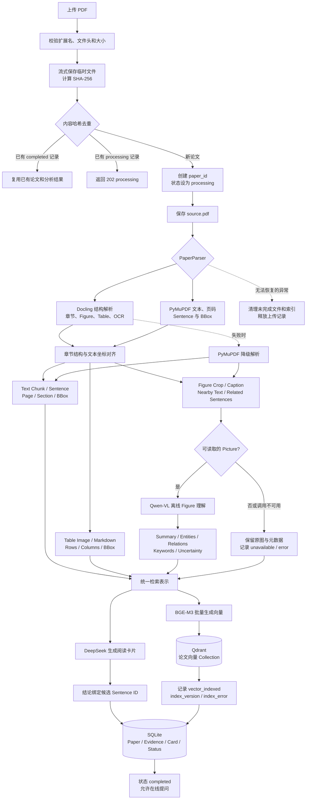
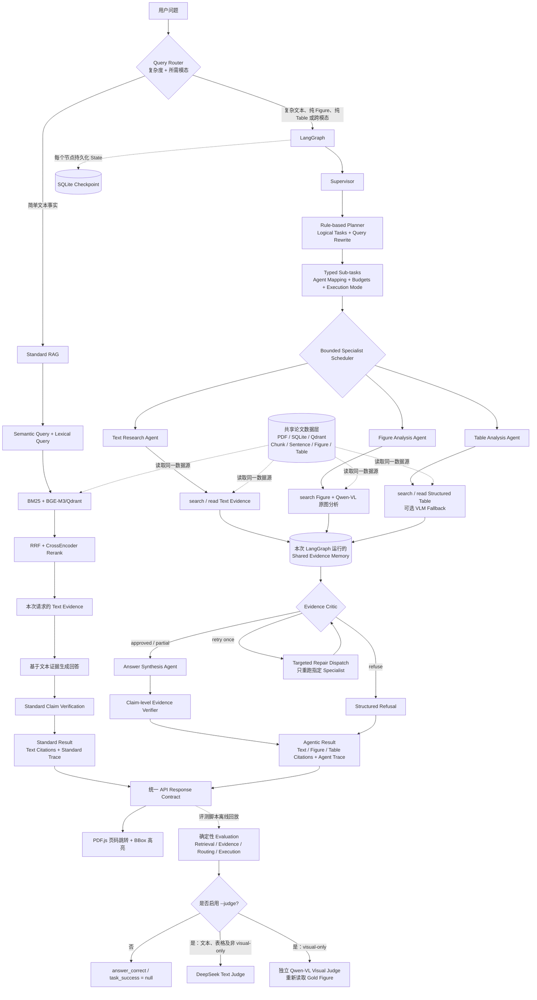

# PaperLens 4.0

Evidence-Grounded Multimodal Agentic RAG for Scientific Paper Reading。

系统保留原有文本 RAG 与 `sentence_id → page + bbox(es) → PDF.js` 高亮链路，并以 LangGraph 编排 Supervisor、Text/Figure/Table Specialists、Evidence Critic 和 Answer Agent。复杂问题支持共享证据池、跨模态冲突检查、一次定向返工、结构化拒答、SQLite Checkpoint 与全链路 Evaluation。

## 系统架构与 Agentic RAG 流程

系统分为两个阶段：论文上传时完成解析、离线视觉理解与向量建库；用户提问时由 Query Router 在 Standard RAG 和 LangGraph 多智能体链路之间分流。

### 论文上传、离线解析与索引



离线阶段持久化的是 BGE-M3/Qdrant 稠密向量索引；BM25 在在线检索时根据当前论文的 Chunk 计算词法排名。Docling 失败时系统降级到 PyMuPDF，保留基本文本、页码、Sentence BBox 与图片能力。

### 在线问答与 LangGraph 多智能体编排



Router 只负责入口分流、复杂度和模态识别；Planner 是 Supervisor 内部的规则规划组件，并非独立 LangGraph Agent。纯 Figure 和纯 Table 问题同样进入 LangGraph，由 Supervisor 分派给对应 Specialist。Standard RAG 与 Agentic RAG 读取同一份持久化论文数据和索引，但每次请求的 Query Plan、候选结果、Evidence、State、Citation 与 Trace 相互隔离；两条线路最后汇合的只是统一 API 响应协议，而不是 Evidence Memory。正常在线问答在返回 API/UI 结果后结束，Standard RAG 的 Claim Verification 不等同于评测 Judge；只有评测脚本离线回放时才进入 Evaluation，启用 `--judge` 后，文本、表格及非 `visual-only` 样本使用 DeepSeek Text Judge，`visual-only` 样本使用独立 Qwen-VL Visual Judge。未启用 Judge 时，`answer_correct` 与 `task_success` 保持 `null`。当前子任务的 `dependencies` 均为空，Scheduler 支持无依赖 Specialist 的串行或并行执行，尚未实现通用依赖拓扑调度。

| 层次 | 主要职责 | 关键实现 |
|---|---|---|
| 解析与索引 | 保留论文结构、原图、表格和句子坐标 | Docling、PyMuPDF、SQLite、Qdrant |
| 检索 | 词法、语义、融合与精排 | BM25、BGE-M3、RRF、BGE CrossEncoder |
| Agent | 职责隔离、多智能体调度与有界返工 | LangGraph、Supervisor、Specialists、Critic、Shared Evidence Memory |
| 可信回答 | 限制证据 ID、验证原子 Claim、结构化拒答 | DeepSeek、统一 Evidence Contract |
| 视觉理解 | 对命中原图执行问题相关分析和独立评测 | Qwen-VL、版本化缓存、低分辨率放大 |
| 可观测性 | 记录路由、工具、候选、耗时和模型调用 | Agent Trace、离线 Evaluation |

## 核心能力

- Text：原有 Chunk/Sentence 解析、BM25、Dense、RRF、reranker、DeepSeek 生成与句子级验证完整保留。
- Figure：Docling 优先裁出具体 Figure；保存 caption、section、nearby_text、related_sentence_ids 和原图。建库时调用一次 Qwen-VL 生成结构化检索描述；查询时只对命中的 Figure 查看原图。
- Figure 编号：问题显式指定 `Figure N`/`图 N` 且图注中存在该编号时，检索会先执行精确约束，只分析被点名的原图；图注编号缺失时自动退回语义检索。
- 视觉读取：低分辨率 Figure 会在内存中按比例放大后再发送给 Qwen-VL，原始文件不变；查询缓存带显式版本，提示词或预处理升级后不会复用旧版结果。
- Table：Docling Markdown 同时保留为原文、列名和行对象，经 BM25/Dense 检索；结构化表不可读时可通过 `TABLE_VLM_FALLBACK_ENABLED` 显式启用 Qwen‑VL fallback。
- Agent：Supervisor 生成 typed sub-tasks，Text/Figure/Table Agents 只调用白名单工具；Critic 检查模态覆盖和数值冲突，并最多定向返工一次。
- Evidence：`text | figure | table` 统一为 `evidence_id/type/page/bbox/content/section/metadata`；旧 sentence_id 不变。
- Verification：所有模型返回 ID 都先与候选集合比对；unsupported claim 会被删除。
- Recovery：外部 API 有限指数退避、节点超时、工具/模型/Qwen‑VL 预算、SQLite Checkpoint 和结构化错误；网络重试与 Critic 返工分开统计。
- Trace：记录 router、plan、每个 Agent/Node/Tool、result IDs、缓存命中、延迟、token usage、Qwen-VL 调用、Critic 决策与恢复结果。
- Evaluation：比较 `standard_rag`、`text_agentic_rag`、`multimodal_agentic_rag`；各模态独立计算 Top-K，并分开报告执行成功与答案正确。

## 启动

```powershell
conda activate paperlens
cd D:\Desktop\job\demo
pip install -r requirements.txt
Copy-Item .env.example .env
# 将两个 YOUR_... 占位符替换为实际 Key；不用 Figure 时 Qwen-VL Key 可留空。
# 灰度启用多智能体网页链路：AGENT_ORCHESTRATOR=langgraph
# 可选启用无依赖 Specialist 并行：MULTI_AGENT_PARALLEL_ENABLED=true
uvicorn app.main:app --host 127.0.0.1 --port 8010
```

健康检查：`GET /api/health`。未设置 `QDRANT_URL` 时使用 `data/qdrant` 的单进程本地存储。

## API

- `POST /api/papers`：上传、解析、Figure 离线理解、索引、生成阅读卡片。
- `POST /api/papers/{paper_id}/reanalyze`：使用当前 parser/index/多模态版本重新分析。
- `POST /api/papers/{paper_id}/ask`：自动选择 Standard 或 Agentic RAG。
- `GET /api/papers/{paper_id}/evidence/{evidence_id}`：统一读取 text/figure/table Evidence。
- `GET /api/papers/{paper_id}/traces/{run_id}`：读取持久化 Trace。
- `GET /api/papers/{paper_id}/figures/{figure_id}`：读取 Figure/Table 原始图像。
- `POST /api/evaluation`：提交离线记录并计算三模式指标。

Agent Tool 层提供：`search_text`、`search_figures`、`search_tables`、`read_text`、`read_sentence`、`read_section`、`read_figure`、`analyze_figure_for_query`、`read_table`、`get_evidence`。

详细节点、边与恢复路径见 [LangGraph 多智能体架构](docs/langgraph-multi-agent-architecture.md)，实施决策见 [升级技术方案](docs/langgraph-multi-agent-upgrade-plan.md)。

## 索引与评测

旧论文需要执行重新分析，才能得到稳定 Figure/Table ID、邻近正文及完整 Qwen-VL 描述。只补描述和 v3 多模态向量索引可运行：

```powershell
python scripts\reindex_papers.py
```

原有文本检索/RAG 评测仍使用 `scripts/evaluate.py`。三模式统一指标接受 JSON 或 JSONL：

```powershell
python scripts\evaluate_agentic.py evals\agentic-results.jsonl --top-k 5
```

每条记录可提供 `mode`、expected/returned evidence IDs、各模态排名 IDs、claims、routing、steps、tool_calls、latency_ms、token_usage、qwen_vl_calls。输出包括按模态计算的 Recall@K/MRR、Evidence P/R/F1、Faithfulness、Claim Support Rate、执行成功率、答案正确率、Task Success、平均步骤/调用、重复率、路由准确率、延迟、Token 与 Qwen-VL 成本计数。路由准确率比较 Gold 模态与 Router 的实际 `routed_modalities`，不再用可能受拒答影响的最终引用模态。文本检索以 Chunk ID 计算 Retrieval，最终引用以 Sentence ID 计算 Evidence；二者不会再混用。未启用 Judge 时，`answer_correct` 与 `task_success` 为 `null`，不会把“执行完成”误当成“答案正确”。

显式 `Figure N` / `Table N` 查询直接使用元数据精确定位，不启动 Dense/Reranker。普通文本 `hybrid-rerank` 默认精排融合排名前 8 个候选，并将单对最大长度限制为 256 tokens；可通过 `RERANK_CANDIDATE_LIMIT` 和 `RERANK_MAX_LENGTH` 调整。检索 Trace 会分别记录 `bm25_latency_ms`、`dense_latency_ms` 与 `rerank_latency_ms`，用于定位性能瓶颈。

`--mode rag --judge` 对带 `visual-only` 标签的题使用独立 Qwen-VL 原图裁判，并单独记录 `visual_judge_qwen_vl_calls`。在线问答的二次视觉核验默认关闭；如需以额外一次 Qwen-VL 调用换取更保守的视觉答案检查，可设置 `ENABLE_ONLINE_VISUAL_JUDGE=true` 后重启服务。

视觉 Judge 会先生成 image-only observation，再分别检查 Gold 与候选答案。若 Gold 本身与原图冲突，报告使用 `dataset_issue=true` 并从答案正确率分母中排除该样本，避免坏标注制造假阴性。

纯 Figure 问题只执行 Figure Retrieval/Reading，不再附带 Text Retrieval。在线视觉二次核验与首次分析冲突时，回答状态改为 `partial`，Figure-backed claim 标记为 `visually_contested`，网页优先显示“视觉核验未通过”。

## 评测方法与最终结果

冻结主评测集 `questions.v2.jsonl` 由 5 篇论文的 20 条人工标注问题组成，并按论文划分为 `dev` 12 条和 `test` 8 条，同一篇论文不会同时进入两个 split。新增 `questions.v3.jsonl` 扩展为 30 条，经统一 Sentence/Figure/Table Evidence 校验通过，暂不作为最终对外指标。题目覆盖简单文本事实、复杂文本推理、结构化表格、必须观察原图的视觉问题，以及论文未报告目标信息时的拒答问题。

- Retrieval 使用人工标注的 Chunk/Figure/Table ID 计算 Recall@5 与 MRR；最终 Citation 使用 Sentence/Figure/Table Evidence ID 计算 Precision、Recall 和完整证据组命中率。
- 同一问题存在多处等价原文时，可使用 `expected_evidence_groups` 表示可替代 Gold 证据组。
- `execution_success` 只衡量链路是否正常完成；`answer_correct` 只在 Judge 可用时确定；`task_success` 要求执行与答案均正确。
- 文本答案由 DeepSeek 根据标准答案、Gold 原文和实际引用证据进行 0–2 分裁判；`visual-only` 问题由独立 Qwen-VL 重新查看 Gold Figure，避免使用回答链路的视觉分析自证。
- 所有参数先在 `dev` 上确定，随后冻结配置并只运行一次 `test`；没有根据最终 test 报告继续调参。

### Legacy 单 Agent 基线

Legacy 最终配置使用 `hybrid-rerank`、Rerank Top-8、最大输入长度 256、版本 2 Figure 查询缓存，并关闭在线二次视觉检查。旧版完整原始报告见 [Legacy Dev](evals/report-dev-rag-optimized-cold.json) 和 [Legacy Test](evals/report-test-final.json)。

| 指标 | Dev（12 条） | Test（8 条） |
|---|---:|---:|
| 执行成功率 | 100% | 100% |
| Task Success | 100%（12/12） | 100%（8/8） |
| Answerability Accuracy | 100% | 100% |
| Refusal Accuracy | 100% | 100% |
| Modality Routing Accuracy | 100% | 100% |
| Retrieval Recall@5 / MRR | 1.000 / 1.000 | 0.833 / 0.833 |
| Exact Gold Citation Hit | 100% | 83.33%（5/6 个可回答问题） |
| Evidence Precision / Recall | 0.944 / 1.000 | 0.833 / 0.833 |
| Answerable-case Judge 平均分 | 2.0 / 2.0 | 2.0 / 2.0 |
| 平均端到端延迟 | 8.22 s | 8.50 s |
| P95 端到端延迟 | 23.39 s | 28.85 s |
| Dataset Issue | 0 | 0 |

### LangGraph 多智能体 Dev/Test

LangGraph 使用相同的冻结 v2 数据集、检索配置与 Judge 口径。所有参数先在 Dev 上确定；随后保持配置不变，只运行一次 8 题 Test，未根据 Test 结果继续调参。完整报告见 [并行 Dev](evals/report-dev-langgraph-final.json)、[串行 Dev](evals/report-dev-langgraph-serial.json)、[最终 Test](evals/report-test-langgraph-final.json) 和 [消融摘要](evals/report-langgraph-ablation.json)。

| 指标 | Dev Serial（12 条） | Dev Parallel（12 条） | Final Test（8 条） |
|---|---:|---:|---:|
| Task Success / Answer Correct | 100% / 100% | 100% / 100% | 100% / 100% |
| Retrieval Recall@5 / MRR | 1.000 / 1.000 | 1.000 / 1.000 | 0.833 / 0.833 |
| Evidence Precision / Recall / F1 | 0.944 / 1.000 / 0.963 | 0.944 / 1.000 / 0.963 | 0.833 / 0.833 / 0.833 |
| Modality Routing Accuracy | 100% | 100% | 100% |
| Refusal Accuracy | 100% | 100% | 100% |
| Node Failure Rate | 0% | 0% | 0% |
| 平均 Agent 数 | 2.33 | 2.33 | 3.00 |
| 平均 Token Usage | 5180.92 | 5128.08 | 2852.88 |
| Qwen-VL 总调用（含独立视觉 Judge） | 2 | 2 | 2 |
| 平均端到端延迟 | 6.79 s | 6.54 s | 7.66 s |
| P95 端到端延迟 | 28.27 s | 24.27 s | 31.89 s |

并行相对串行保持质量指标完全一致，平均延迟下降 3.7%，P95 下降 14.1%。相对历史 Legacy Dev，LangGraph 并行平均延迟低 20.4%，但两份报告生成时间与缓存状态不同，该差值只作为方向性工程观察，不作为严格因果结论。最终 Test 的 8/8 条执行成功且答案判定正确，两个不可回答问题均正确拒答；测试期间没有节点失败、恢复或 Critic 返工。

Test 中唯一未命中精确 Gold 的 `minda-zero-shot-text-01` 检索到了其他直接支持答案的论文句子，Claim verifier 与文本 Judge 均判定答案正确。因此 83.33% 是 6 个可回答问题上的严格 ID 匹配结果，不能表述为答案错误；冻结后的 Test 报告保持不变，未来评测集版本可将这些位置标注为可替代 Evidence Group。

### 性能优化结果

在相同 12 条 dev RAG 评测上，显式 Figure/Table 编号改为元数据精确定位，纯 Table 路由不再附带 Text Retrieval，CrossEncoder 精排候选由 16 个降至 8 个，并限制为 256 tokens。优化后平均端到端延迟从 21.10 s 降至 8.22 s，下降 61.1%；P95 从 45.97 s 降至 23.39 s，下降 49.1%，同时保持 dev Task Success、路由准确率和 Retrieval Recall@5 均为 100%。Trace 进一步表明，热态文本检索的主要耗时仍来自 CrossEncoder，首次访问新论文时还包含本地 Dense/Qdrant 冷启动成本。

### 复现最终评测

使用本地 Qdrant 时先停止 Uvicorn，避免两个进程同时占用本地存储。命令会将相关论文证据发送到已配置的 DeepSeek/Qwen-VL API：

```powershell
python scripts\validate_dataset.py --dataset evals\questions.v2.jsonl
python scripts\validate_dataset.py --dataset evals\questions.v3.jsonl
python scripts\evaluate.py --dataset evals\questions.v2.jsonl --split dev --mode rag --strategy hybrid-rerank --orchestrator langgraph --parallel --judge --output evals\report-dev-langgraph-final.json
# 冻结 Test 已按此命令运行一次；不要用 Test 继续调参：
python scripts\evaluate.py --dataset evals\questions.v2.jsonl --split test --mode rag --strategy hybrid-rerank --orchestrator langgraph --parallel --judge --output evals\report-test-langgraph-final.json
```

说明：20 条题目适合展示端到端工程闭环和回归能力，但不足以代表大规模统计结论。简历和项目介绍应同时写明论文数量、样本量以及 Judge 类型。

## 已知边界

- 未配置真实 DeepSeek/Qwen-VL Key 时，解析与检索可运行，但生成或视觉阅读会明确返回 unavailable；不会伪造模型结果。
- PyMuPDF 降级路径只能导出 PDF 内嵌且足够大的位图；复杂矢量 Figure 仍依赖 Docling 的区域渲染质量。
- Table VLM fallback 默认关闭；启用后会增加 Qwen‑VL 成本，结构化与视觉结果均不可用时会返回 partial/refusal。
- Router/Planner 第一版采用可测试规则，不是训练过的意图分类器。
- Critic 的跨模态冲突检查目前以结构化 Agent Result、必要模态覆盖和同名数值冲突为主，不等同于领域专家审稿。
- LangGraph Checkpoint 支持按 `run_id` 读取状态；当前 UI 尚未提供人工审批后从中断节点继续的操作界面。
- Web UI 仍是轻量单页 PDF.js 阅读器，支持跳页和 bbox 高亮，但没有缩略图、连续滚动或缩放控件。
