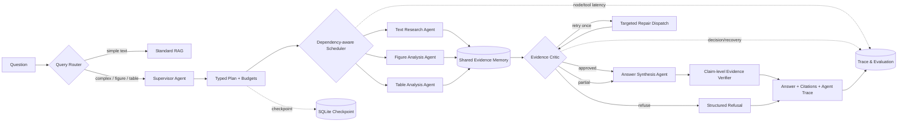

# PaperLens LangGraph 多智能体架构

## Agent 与工具边界

| Agent | 允许调用的工具 | 主要输出 |
|---|---|---|
| Supervisor | Planner / Query Rewrite | typed sub-tasks、依赖、预算、串/并行策略 |
| Text Research | `search_text` | Sentence/Chunk Evidence |
| Figure Analysis | `search_figures`、`analyze_figure_for_query` | 原图观察、Figure Evidence |
| Table Analysis | `search_tables`、`read_table`、可选 Table VLM fallback | 结构化行列、Table Evidence |
| Evidence Critic | 不检索、不改写事实 | approved/retry/partial/refuse、冲突与缺口 |
| Answer Synthesis | 只读审核后的 Shared Evidence | 原子 Claims、Evidence IDs、限制说明 |

## 有界恢复

- 外部 API 只对超时、网络故障、429 和 5xx 做指数退避，默认最多重试 2 次。
- Critic 返工与网络重试分开计数；Critic 全局最多定向返工 1 次。
- 全局限制工具步数、模型调用数、Qwen‑VL 调用数和执行时限。
- 每次 LangGraph 运行以 `run_id` 写入独立 SQLite Checkpoint，可读取最终 channel state。
- Evidence 按 `evidence_id` 稳定去重；失败、超时、预算耗尽均写入 Trace，不静默吞错。

## 兼容与切换

Web 服务通过 `AGENT_ORCHESTRATOR=legacy|langgraph` 灰度切换；命令行 RAG 评测默认使用 LangGraph，也可用 `--orchestrator legacy` 复现旧链路。`--parallel` 只并行执行无依赖 Specialist，结果仍按计划顺序合并。
