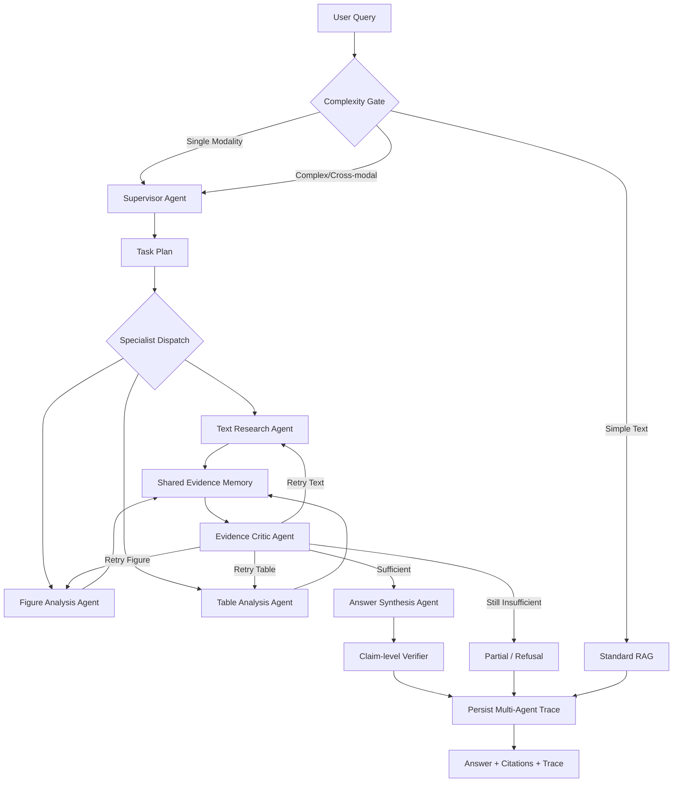

# PaperLens LangGraph 多智能体编排升级技术方案

> 文档状态：实施完成（v1.0，2026-09-20）；本文件保留原始任务清单，逐阶段验收结果见 [实施记录](langgraph-implementation-progress.md)。  
> 适用项目：PaperLens 4.0（由 PaperLens 3.0 基线升级）  
> 升级目标：在保留现有 RAG、Tools、Evidence、Evaluation 和前端能力的基础上，引入基于 LangGraph 的可控多智能体编排。  
> 当前评测基线：5 篇论文、20 条人工标注问题，其中 Dev 12 条、Test 8 条。

## 1. 背景

PaperLens 当前已经是一个受控的多模态 Agentic RAG 系统，具备：

- Text、Figure、Table 三类 Evidence；
- Query Router、Planner、Evidence Tools 和有界 Agent Loop；
- BM25、BGE-M3、Qdrant、RRF、CrossEncoder Rerank；
- Qwen-VL Figure 理解和独立 Visual Judge；
- Claim-level Evidence Verifier、结构化拒答和 PDF 原文高亮；
- Agent Trace 与独立 Evaluation Pipeline；
- Dev/Test 按论文隔离的 20 条 Benchmark；
- 优化前后可复现的延迟与质量报告。

当前 Agent 主要由规则 Router、Planner 和单一 Executor 驱动。它可以选择工具和执行有限改写，但不同模态尚未形成职责、状态和失败边界明确的专业智能体，也缺少智能体级调度、Checkpoint、定向返工和多智能体对照评测。

本次升级不重写现有业务能力，而是在其上增加 LangGraph 编排层。

## 2. 升级目标

### 2.1 核心目标

1. 引入 Supervisor 驱动的多智能体任务分解和调度。
2. 将 Text、Figure、Table 能力封装为职责明确的 Specialist Agents。
3. 建立 Shared Evidence Memory，统一聚合、去重和追踪证据。
4. 增加 Evidence Critic，检查证据覆盖、冲突和回答条件。
5. 支持 Critic 对特定 Specialist 发起最多一次定向返工。
6. 增加节点级超时、有限重试、失败降级和 Checkpoint。
7. 保留 Legacy Executor，通过配置在 Legacy 与 LangGraph 之间切换。
8. 使用相同 Benchmark 对比单 Agent 与多 Agent 的质量、延迟和成本。

### 2.2 非目标

首期不实现：

- 无上限的 Agent 自由讨论；
- 由 LLM 任意生成或执行代码；
- 十个以上角色的复杂群聊；
- Kafka、Kubernetes 或独立微服务拆分；
- 多租户、RBAC/OAuth；
- 自训练 Router、Embedding 或视觉模型；
- 将所有简单问题强制送入多智能体链路。

## 3. 设计原则

### 3.1 保留基线

- 不删除 `app/agent/executor.py`。
- 不覆盖现有 `questions.v2.jsonl`。
- 不覆盖现有三份基线报告。
- Legacy 与 LangGraph 使用相同 Parser、Retriever、Tools、Evidence 和模型配置。
- 所有升级通过配置开关启用，出现回归时可以立即切回 Legacy。

### 3.2 复杂度感知

- 简单文本事实题继续使用 Standard RAG。
- 单 Figure 或单 Table 题只启动对应 Specialist。
- 复杂文本题启动 Text Agent 和 Critic。
- 只有跨模态、需要证据组合或存在冲突的题目才启动完整多智能体编排。

### 3.3 可控优先

- 设置最大步骤、最大返工次数、节点超时和模型调用预算。
- Specialist 只调用白名单 Tools。
- Answer Agent 只能使用 Shared Evidence Memory 中已验证的 Evidence。
- Critic 只能触发预定义返工，不允许无限循环。
- 所有 Agent 输出必须满足结构化契约。

### 3.4 可评测和可追踪

- 每个 Agent、Node 和 Tool 都记录输入摘要、输出状态、Evidence ID、耗时和错误。
- 区分执行成功、答案正确、精确证据命中和语义证据支持。
- 同时报告质量、延迟、Token 和模型调用成本。

## 4. 总体架构



## 5. 智能体职责

### 5.1 Supervisor Agent

职责：

- 判断任务目标和所需模态；
- 将问题拆分为有明确产出的子任务；
- 为子任务选择 Specialist；
- 标记任务依赖关系；
- 决定串行或并行；
- 维护步骤、时间、Token 和模型调用预算；
- 汇总 Specialist 状态并决定是否进入 Critic。

Supervisor 不直接检索论文，也不生成最终答案。

计划输出示例：

```json
{
  "goal": "判断方法主张是否得到实验支持",
  "execution": "parallel",
  "tasks": [
    {
      "task_id": "task_1",
      "agent": "text_agent",
      "instruction": "提取论文的主要方法主张",
      "required_modalities": ["text"],
      "dependencies": []
    },
    {
      "task_id": "task_2",
      "agent": "table_agent",
      "instruction": "读取关键实验表格并提取对比结果",
      "required_modalities": ["table"],
      "dependencies": []
    }
  ]
}
```

### 5.2 Text Research Agent

可调用：

- `search_text`
- `read_text`
- `read_sentence`
- `read_section`
- `get_evidence`

职责：

- BM25/Dense/Hybrid/Hybrid-Rerank 检索；
- 查询改写与章节约束；
- 提取直接支持结论的 Sentence/Chunk Evidence；
- 判断论文是否明确报告目标信息；
- 返回证据、候选 Claim 和信息缺口。

### 5.3 Figure Analysis Agent

可调用：

- `search_figures`
- `read_figure`
- `read_figure_context`
- `analyze_figure_for_query`
- `get_evidence`

职责：

- 显式 Figure 编号精确定位；
- 语义 Figure 检索；
- Qwen-VL 原图观察；
- 区分视觉 observation 与 inference；
- 提取标签、颜色、位置、箭头和流程关系；
- 关联 caption、section 和 nearby text；
- 报告视觉不确定性和缺失信息。

### 5.4 Table Analysis Agent

可调用：

- `search_tables`
- `read_table`
- `get_evidence`
- `analyze_table_image_with_vlm`（在后续阶段启用）

职责：

- 显式 Table 编号精确定位；
- 读取结构化 Markdown、表头、行和列；
- 执行有限的数值比较和聚合；
- 检测表头错位、合并单元格和解析失败；
- 结构化解析不可靠时选择 VLM fallback 或返回 partial。

### 5.5 Evidence Critic Agent

职责：

- 检查每个子任务是否获得所需模态证据；
- 检查 Claim 是否有直接 Evidence 支持；
- 检查正文、Figure、Table 之间是否冲突；
- 检查数值、单位和比较方向；
- 区分“论文未报告”与“系统未检索到”；
- 指定一个 Specialist 定向返工；
- 决定 `approved`、`retry`、`partial` 或 `refuse`。

Critic 不允许自行补写论文事实，也不直接修改 Evidence 内容。

### 5.6 Answer Synthesis Agent

职责：

- 只读取 Critic 通过的 Evidence；
- 生成与提问语言一致的简洁回答；
- 将答案拆成 Atomic Claims；
- 为每个 Claim 绑定 Evidence ID；
- 控制引用数量；
- 对不完整证据明确表达限制。

最终仍复用现有 Claim-level Verifier，不以 Answer Agent 的自我判断代替证据校验。

## 6. 共享状态设计

建议定义 `MultiAgentState`：

```python
class MultiAgentState(TypedDict, total=False):
    run_id: str
    paper_id: str
    question: str
    requested_strategy: str

    route: dict
    plan: dict
    pending_tasks: list[dict]
    completed_tasks: list[dict]

    agent_results: dict[str, dict]
    evidence: list[dict]
    evidence_ids: list[str]

    critique: dict
    retry_targets: list[str]
    retry_count: int

    answer: dict
    errors: list[dict]

    total_steps: int
    token_usage: int
    qwen_vl_calls: int
    started_at: float
    deadline_at: float
```

状态更新原则：

- 节点返回增量更新，不直接覆盖无关字段；
- Evidence 以 `evidence_id` 去重；
- Agent 结果按 `task_id` 保存；
- Error 只追加，不静默删除；
- `retry_count` 全局有界，首期最大为 1；
- Answer Agent 不修改原始 Agent Result。

## 7. 智能体输出契约

所有 Specialist 使用统一结果：

```json
{
  "agent": "figure_agent",
  "task_id": "task_2",
  "status": "success",
  "observations": [],
  "inferences": [],
  "candidate_claims": [],
  "evidence_ids": [],
  "missing_information": [],
  "confidence": 0.0,
  "retryable": false,
  "tool_calls": [],
  "latency_ms": 0.0,
  "token_usage": 0,
  "model_calls": 0,
  "errors": []
}
```

`status` 只能是：

- `success`：任务完成且证据可用；
- `partial`：有部分证据，但不能完整完成任务；
- `failed`：节点执行失败；
- `unavailable`：依赖配置或模型不可用；
- `not_applicable`：该任务不适用于当前论文或问题。

## 8. LangGraph 节点与边

### 8.1 节点

1. `complexity_gate`
2. `supervisor_plan`
3. `dispatch_specialists`
4. `text_agent`
5. `figure_agent`
6. `table_agent`
7. `merge_evidence`
8. `evidence_critic`
9. `repair_dispatch`
10. `answer_agent`
11. `claim_verifier`
12. `structured_refusal`
13. `persist_trace`

### 8.2 条件边

```text
complexity_gate:
  simple_text       -> legacy_standard_rag
  single_modality   -> supervisor_plan
  complex_text      -> supervisor_plan
  cross_modal       -> supervisor_plan

evidence_critic:
  approved          -> answer_agent
  retry             -> repair_dispatch
  partial           -> answer_agent
  refuse            -> structured_refusal

repair_dispatch:
  retry_count < 1   -> selected_specialist
  retry_count >= 1  -> structured_refusal / partial answer
```

## 9. 并行策略

首期分两步实施：

### 9.1 第一阶段：串行正确性

- 所有 Specialist 按计划串行执行；
- 验证状态合并、Evidence 去重、Critic 和返工逻辑；
- 避免并行问题干扰功能正确性定位。

### 9.2 第二阶段：安全并行

- 只并行执行无依赖的 Specialist；
- 同一任务的读取操作允许并行；
- 模型懒加载需要锁或预热，避免重复加载；
- Qwen-VL/DeepSeek 调用遵守并发限制；
- 本地 Qdrant 保持单服务进程，不通过多个应用进程同时占用本地存储；
- 并行失败时保留其他 Specialist 已完成结果。

## 10. 异常恢复设计

### 10.1 错误分类

```text
InputError          不重试
ConfigurationError  不重试，返回 unavailable
EvidenceNotFound    允许一次查询改写或定向返工
RateLimitError      有限重试
Remote5xxError      有限重试
TimeoutError        有限重试或降级
ParseError          使用现有降级路径或返回 partial
BackendError        使用 BM25/RRF 等已有降级路径
BudgetExceeded      停止执行并返回 partial/refusal
```

### 10.2 重试策略

- 默认每个可重试外部调用最多 2 次；
- 使用指数退避并加入随机抖动；
- 429、连接超时和部分 5xx 可重试；
- 400、401、403、结构化输入错误不重试；
- Critic 定向返工与网络重试分别计数；
- 达到总预算后不再重试。

### 10.3 降级策略

- Dense/Qdrant 失败：保留 BM25 结果；
- Reranker 失败：保留 RRF 融合排序；
- Figure Agent 失败：可使用 caption/nearby text，但不得声称观察到图像事实；
- Table 结构化失败：启用可选 Table VLM，仍失败则返回 partial；
- 单个 Specialist 失败：由 Critic 判断其他证据是否足够；
- Answer Agent 失败：保留结构化 Evidence，不伪造答案；
- Checkpoint 写入失败：记录错误并以无恢复模式完成当前请求。

### 10.4 Checkpoint

建议将 LangGraph Checkpoint 与业务数据库分离：

```text
data/langgraph-checkpoints.sqlite3
```

Checkpoint 至少保存：

- `run_id`
- `paper_id`
- 当前节点
- 已完成任务
- Evidence ID
- 重试次数
- 错误状态
- 最后更新时间

涉及数据库 Schema 修改前，先备份现有 `paperlens.sqlite3`。

## 11. Trace 与可观测性

现有 Trace 扩展为 Node/Agent/Tool 三级：

```json
{
  "run_id": "...",
  "orchestrator": "langgraph",
  "node": "figure_agent",
  "agent": "figure_agent",
  "task_id": "task_2",
  "status": "success",
  "started_at": "...",
  "latency_ms": 2310.4,
  "tool_calls": [],
  "evidence_ids": [],
  "token_usage": 0,
  "qwen_vl_calls": 1,
  "retry_count": 0,
  "cached": false,
  "errors": []
}
```

最终 Trace 需要支持回答以下问题：

- 为什么选择这些 Agent？
- 哪些 Agent 并行或串行执行？
- 每个 Agent 使用了哪些 Tools？
- 哪些 Evidence 被检索、读取、采用或拒绝？
- Critic 为什么要求返工？
- 哪个阶段最耗时？
- 使用了多少 Token 和模型调用？
- 发生异常后走了什么降级路径？

## 12. 配置设计

建议在 `.env.example` 和 `Settings` 中增加：

```env
# legacy | langgraph
AGENT_ORCHESTRATOR=legacy

MULTI_AGENT_MAX_STEPS=10
MULTI_AGENT_MAX_RETRIES=1
MULTI_AGENT_TIMEOUT_SECONDS=120
MULTI_AGENT_PARALLEL_ENABLED=false
MULTI_AGENT_MAX_MODEL_CALLS=8
MULTI_AGENT_MAX_QWEN_VL_CALLS=2

LANGGRAPH_CHECKPOINT_ENABLED=true
LANGGRAPH_CHECKPOINT_PATH=data/langgraph-checkpoints.sqlite3

TABLE_VLM_FALLBACK_ENABLED=false
```

所有参数需要在 Trace 和评测报告中记录，保证结果可复现。

## 13. 代码目录与改动范围

### 13.1 新增目录

```text
app/multi_agent/
├── __init__.py
├── state.py
├── graph.py
├── supervisor.py
├── scheduler.py
├── trace_adapter.py
└── agents/
    ├── __init__.py
    ├── base.py
    ├── text_agent.py
    ├── figure_agent.py
    ├── table_agent.py
    ├── critic_agent.py
    └── answer_agent.py
```

### 13.2 需要修改

- `requirements.txt`：增加并固定 LangGraph 兼容版本；
- `.env.example`：增加多智能体配置；
- `app/config.py`：读取和校验配置；
- `app/main.py`：按配置选择 Legacy 或 LangGraph；
- `app/schemas/trace.py`：增加 Agent/Node 级字段；
- `app/repository.py`：持久化运行状态或 Checkpoint 引用；
- `app/tools/evidence_tools.py`：仅在必要时补充异步适配，不改变 Evidence Contract；
- `scripts/evaluate.py`：记录 orchestrator、Agent、返工和恢复指标；
- `app/evaluation/metrics.py`：增加多智能体指标。

### 13.3 保持复用

- `app/services/parser.py`
- `app/services/retrieval.py`
- `app/services/reading.py`
- `app/multimodal/`
- `app/tools/`
- `app/schemas/evidence.py`
- `app/static/`
- 当前 SQLite/Qdrant 数据结构（除非新增独立运行状态表）

## 14. 版本与基线保护

### 14.1 必须保留的文件

```text
evals/questions.v2.jsonl
evals/report-dev-rag-p1.json
evals/report-dev-rag-optimized-cold.json
evals/report-test-final.json
```

其中：

- `report-dev-rag-p1.json`：性能优化前 Dev 基线；
- `report-dev-rag-optimized-cold.json`：单 Agent 最终 Dev；
- `report-test-final.json`：冻结后的单 Agent Test。

### 14.2 新报告命名

```text
evals/report-dev-langgraph.json
evals/report-test-langgraph.json
evals/report-ablation-legacy-vs-langgraph.json
evals/report-failure-recovery-langgraph.json
```

### 14.3 Git 建议

在升级副本中：

1. 先完成 `.gitignore`；
2. 排除 `.env`、`models/`、`data/qdrant/`、`uploads/`、`__pycache__/` 和测试缓存；
3. 提交当前单 Agent 版本；
4. 创建基线 Tag；
5. 在独立分支开发 LangGraph。

建议名称：

```text
tag: v3-single-agent-baseline
branch: feature/langgraph-multi-agent
```

## 15. Evaluation 方案

### 15.1 第一阶段：冻结的 20 条回归集

使用 `questions.v2.jsonl` 对比：

- Legacy Agentic RAG；
- LangGraph Multi-Agent RAG。

必须报告：

- Execution Success；
- Answer Correct；
- Task Success；
- Answerability Accuracy；
- Refusal Accuracy；
- Modality Routing Accuracy；
- Retrieval Recall@5/MRR；
- 分模态 Recall/MRR；
- Exact Gold Citation Hit；
- Evidence Precision/Recall/F1；
- 平均与 P95 延迟；
- Token Usage；
- DeepSeek/Qwen-VL 调用次数；
- 平均 Agent 数和步骤数；
- Critic 返工率；
- Node 失败率；
- 异常恢复成功率。

### 15.2 第二阶段：扩展 Benchmark

新建 `questions.v3.jsonl`，不要修改已冻结的 v2。建议扩展到 30–50 条，并优先增加：

- Text + Figure 组合问题；
- Text + Table 组合问题；
- Figure + Table 组合问题；
- 三模态联合问题；
- 模态间证据冲突；
- 必须由 Critic 触发返工的问题；
- 一个 Specialist 失败但其他证据足够的问题；
- 论文确实没有答案的问题；
- 简单题，验证系统不会无意义启动全部 Agent。

新论文应继续按论文划分 Dev/Test，避免同一论文同时进入两个 Split。

### 15.3 对照实验

至少包含：

1. Legacy 单 Agent；
2. Multi-Agent 无 Critic；
3. Multi-Agent + Critic；
4. Multi-Agent + Critic + 定向返工；
5. 串行 Specialist；
6. 并行 Specialist。

目的是回答：

- 多智能体是否提高跨模态问题质量？
- Critic 是否减少无依据 Claim？
- 定向返工是否值得额外成本？
- 并行是否降低端到端延迟？
- 简单题是否避免多智能体开销？

## 16. 测试计划

### 16.1 单元测试

新增：

```text
tests/test_multi_agent_state.py
tests/test_supervisor_agent.py
tests/test_specialist_agents.py
tests/test_evidence_critic.py
tests/test_langgraph_workflow.py
tests/test_multi_agent_recovery.py
tests/test_multi_agent_metrics.py
```

覆盖：

- State 增量合并；
- Evidence ID 去重；
- 简单题路由；
- 单模态 Specialist 调度；
- 跨模态任务拆分；
- Critic approved/retry/partial/refuse；
- 最大返工次数；
- 最大步骤和预算；
- Agent 异常不会破坏其他结果；
- Checkpoint 保存与恢复；
- Trace 字段完整；
- Legacy 配置不改变旧行为。

### 16.2 集成测试

- Mock DeepSeek/Qwen-VL 的正常、超时、429、5xx 和非法 JSON；
- Qdrant 不可用时验证 BM25 降级；
- Reranker 异常时验证 RRF 保留；
- Figure Agent 失败时不得生成视觉观察结论；
- Table Agent 解析失败时验证 VLM fallback 开关；
- Critic 定向返工后验证状态和 Trace；
- 服务重启后验证可恢复运行状态。

### 16.3 端到端测试

- 上传并处理论文；
- 分别运行简单文本、纯 Figure、纯 Table、跨模态和拒答问题；
- 验证答案、引用、PDF 高亮、Agent Trace；
- 运行冻结 Dev/Test；
- 生成 Legacy 与 LangGraph 对比报告。

## 17. 分阶段实施计划

### Phase 0：冻结基线

- [ ] 确认升级副本路径；
- [ ] 配置 `.gitignore`；
- [ ] 提交当前代码并创建 Tag；
- [ ] 冻结 v2 Benchmark 和三份报告；
- [ ] 运行现有测试并保存通过数量；
- [ ] 记录当前依赖版本和启动命令。

完成标准：能够从 Tag 恢复并复现当前 Legacy 行为。

### Phase 1：LangGraph 骨架

- [ ] 增加依赖和配置开关；
- [ ] 定义 MultiAgentState；
- [ ] 建立最小 Graph；
- [ ] 增加 Legacy/LangGraph Executor Adapter；
- [ ] 实现 Multi-Agent Trace 基础结构。

完成标准：LangGraph 可执行最小文本路径，Legacy 无回归。

### Phase 2：Specialist Agents

- [ ] 实现 Text Agent；
- [ ] 实现 Figure Agent；
- [ ] 实现 Table Agent；
- [ ] 复用现有 EvidenceTools；
- [ ] 实现统一 Agent Result；
- [ ] 实现 Shared Evidence Merge。

完成标准：三种单模态问题分别只调用对应 Specialist。

### Phase 3：Supervisor 与复杂任务

- [ ] 实现任务分解；
- [ ] 实现依赖关系；
- [ ] 实现复杂度感知调度；
- [ ] 先完成串行 Specialist 执行；
- [ ] 完成跨模态 Evidence 汇总。

完成标准：跨模态问题能调用两个以上 Specialist 并生成统一证据池。

### Phase 4：Critic 与返工

- [ ] 实现证据覆盖检查；
- [ ] 实现模态冲突检查；
- [ ] 实现数值一致性检查；
- [ ] 实现一次定向返工；
- [ ] 实现 partial/refusal；
- [ ] 接入 Answer Agent 和现有 Claim Verifier。

完成标准：Critic 可拒绝不充分证据，并能指定一个 Agent 返工一次。

### Phase 5：异常恢复与 Checkpoint

- [ ] 统一错误类型；
- [ ] 增加外部 API 有限重试；
- [ ] 增加节点超时；
- [ ] 增加预算控制；
- [ ] 增加 Checkpoint；
- [ ] 增加恢复测试；
- [ ] 保留并验证现有检索降级。

完成标准：模拟单节点异常时，系统能够重试、降级、恢复或明确结束。

### Phase 6：并行与性能

- [ ] 识别无依赖任务；
- [ ] 启用安全并行；
- [ ] 处理模型加载锁和 API 并发限制；
- [ ] 记录 Agent/Node/Tool 延迟；
- [ ] 比较串行与并行结果。

完成标准：并行不改变 Evidence 和答案语义，且延迟收益可测量。

### Phase 7：评测与交付

- [ ] 运行冻结 v2 Dev；
- [ ] 修复回归；
- [ ] 冻结配置；
- [ ] 运行一次 v2 Test；
- [ ] 生成消融报告；
- [ ] 扩展 v3 Benchmark；
- [ ] 更新 README、架构图和简历描述。

完成标准：形成可复现的 Legacy/Multi-Agent 质量、性能和成本对比。

## 18. 验收标准

### 18.1 功能验收

- Legacy 和 LangGraph 两条链路均可启动；
- Standard RAG 不受影响；
- 三个 Specialist 职责和 Tool 权限清晰；
- 跨模态任务可组合多个 Agent 的证据；
- Critic 支持通过、返工、partial 和拒答；
- Claim Verifier 继续约束最终答案；
- PDF 引用和 BBox 高亮继续工作；
- Trace 可还原完整编排过程。

### 18.2 可靠性验收

- Agent 最大步骤和返工次数生效；
- 超时、429、5xx 和非法 JSON 有明确处理；
- 单 Specialist 失败不会无条件导致全链路崩溃；
- 检索降级继续有效；
- Checkpoint 可以保存并恢复至少一个中断场景；
- 失败不会产生伪造 Evidence 或虚假“校验通过”。

### 18.3 回归验收

- 现有单元测试通过；
- 新增多智能体测试通过；
- v2 Dev 不出现不可解释的质量下降；
- 冻结 Test 只在配置确定后运行；
- 所有指标明确报告样本数量和 Judge 类型。

### 18.4 性能验收

- 简单问题不会启动完整多智能体链路；
- 记录 Legacy/Multi-Agent 平均与 P95 延迟；
- 记录 Token 与 Qwen-VL 调用增量；
- 跨模态质量提升必须与额外成本一起报告；
- 并行优化必须通过冷启动和热启动分别验证。

## 19. 风险与应对

| 风险 | 影响 | 应对 |
|---|---|---|
| 为多智能体而多智能体 | 成本上升、延迟变差 | 复杂度感知路由，简单题继续走 Standard RAG |
| LLM Supervisor 输出不稳定 | 任务分解漂移 | JSON Schema、白名单 Agent、规则兜底 |
| Critic 形成无限循环 | 成本失控 | 全局最多一次定向返工 |
| Specialist 输出互相冲突 | 答案不可靠 | Shared Evidence Contract + Critic 冲突检查 |
| 并行访问模型或本地存储 | 资源竞争 | 先串行、再加锁和并发限制 |
| 多 Agent 改善来自 Judge 偏差 | 指标虚高 | 独立 Judge、严格 Citation、人工抽查 |
| 修改 Benchmark 后无法公平比较 | 基线失效 | 冻结 v2，新问题写入 v3 |
| 只增加框架没有真实收益 | 简历价值有限 | 必须完成消融和 Legacy/Multi-Agent 对照 |

## 20. 简历交付目标

完成且获得真实评测结果后，可以按以下结构表述：

> 将单 Agentic RAG 重构为基于 LangGraph 的 Supervisor 多智能体编排系统，由 Text、Figure、Table Specialist Agents 协作完成论文证据检索与分析，并通过 Shared Evidence Memory 和 Evidence Critic 实现跨模态冲突检查、一次定向返工、结构化拒答和全链路 Trace。

> 建立 Legacy 与 Multi-Agent 对照评测，分别统计 Task Success、Citation Hit、分模态 Recall、延迟、Token 和模型调用成本；通过复杂度感知路由避免简单问题承担完整多智能体开销。

量化指标必须等实际报告生成后填写，不提前宣称准确率提升。

## 21. 启动实施前检查表

- [ ] 已确认升级副本的绝对路径；
- [ ] 已确认 `.env` 不会提交；
- [ ] 已确认模型、上传论文和 Qdrant 数据不会提交；
- [ ] 已冻结 `questions.v2.jsonl`；
- [ ] 已保留三份单 Agent 报告；
- [ ] 已记录现有测试结果；
- [ ] 已建立 Legacy/LangGraph 配置开关；
- [ ] 已决定 LangGraph Checkpoint 的独立路径；
- [ ] 已确认第一阶段先实现串行正确性；
- [ ] 已确认所有新指标可以由 Trace 计算。

## 22. Definition of Done

本次升级只有在以下条件全部满足时才算完成：

1. 系统能够在 Legacy 与 LangGraph 编排之间切换；
2. Supervisor、三个 Specialist、Critic 和 Answer Agent 均有清晰契约；
3. 跨模态问题发生真实的多 Agent 协作，而不是简单改名；
4. Critic 至少能完成证据覆盖检查和一次定向返工；
5. 节点超时、有限重试、降级和 Checkpoint 有自动化测试；
6. Agent/Node/Tool/Evidence Trace 完整；
7. 冻结的 20 条 Benchmark 完成 Legacy/Multi-Agent 对比；
8. 产生可复现的质量、延迟和成本报告；
9. README、架构图和简历描述与真实实现及指标一致；
10. 未覆盖旧 Benchmark、旧报告或旧 Executor。
