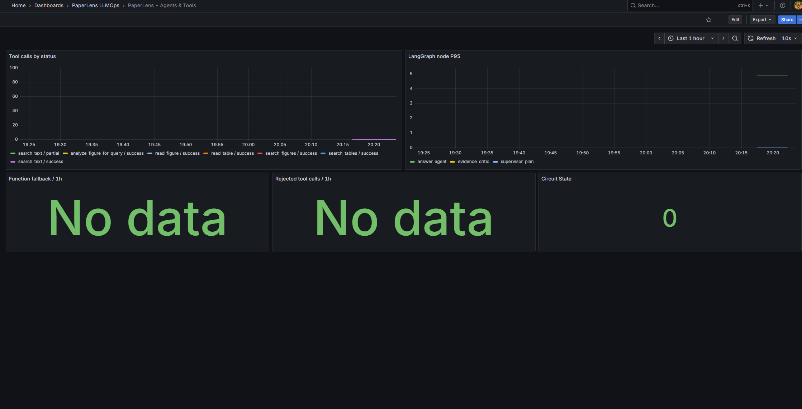
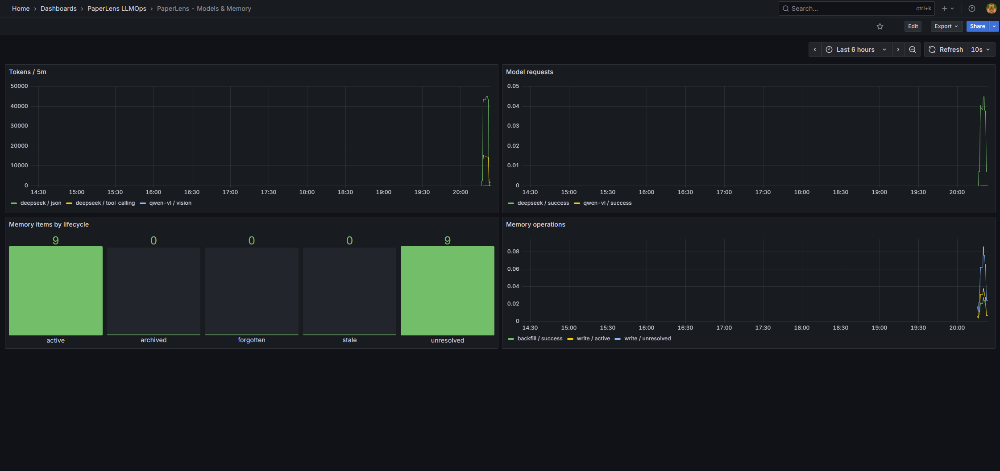
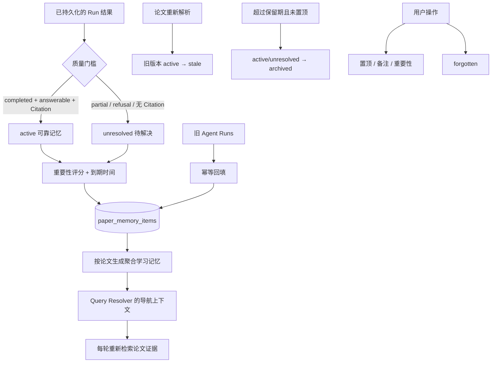

# PaperLens LLMOps 与长期记忆工程指南

## 1. 目标与边界

本次升级解决两个问题：第一，能够回答“某次请求为什么慢、调用了哪些 Agent/Tool/模型、在哪里失败或降级”；第二，让跨会话记忆具备来源、质量门槛、版本、过期、人工编辑和离线评测，而不是把聊天记录直接拼进 Prompt。

当前部署定位仍是单机作品集/开发环境：业务数据使用 SQLite，本地向量索引使用 Qdrant，SSE 事件缓冲位于进程内存，用户范围固定为 `local`。Grafana、Prometheus、Tempo 可以通过 Docker Compose 启动，但不等同于已经完成生产集群、高可用和多租户安全建设。

## 2. LLMOps 数据流

```mermaid
flowchart LR
    UI[浏览器请求 / SSE] --> API[FastAPI]
    API --> RUN[对话 Run]
    RUN --> GRAPH[LangGraph 节点]
    GRAPH --> TOOLS[Text / Figure / Table Tools]
    GRAPH --> MODELS[DeepSeek / Qwen-VL]

    API -. HTTP 指标 .-> METRICS[/metrics]
    RUN -. 运行结果与耗时 .-> METRICS
    GRAPH -. 节点/Tool/Function Calling .-> METRICS
    MODELS -. 延迟/状态/Token .-> METRICS
    METRICS --> PROM[Prometheus]
    PROM --> GRAFANA[Grafana Dashboards]

    API -. request_id .-> LOG[JSON 结构化日志]
    RUN -. run_id / conversation_id / paper_id .-> LOG

    API -. Span .-> OTEL[OpenTelemetry Collector]
    GRAPH -. Span / Event .-> OTEL
    MODELS -. Provider Span .-> OTEL
    OTEL --> TEMPO[Tempo]
    TEMPO --> GRAFANA
```

### 指标设计

指标标签只使用有限枚举，如 route、status、node、tool、provider、operation。论文 ID、会话 ID、Run ID、问题文本和 Evidence ID 不进入指标标签，从源头避免 Prometheus 高基数。它们只用于日志/Trace 关联。

核心指标包括：

- HTTP 请求量和延迟：`paperlens_http_requests_total`、`paperlens_http_request_duration_seconds`
- RAG 运行量、结果和延迟：`paperlens_runs_total`、`paperlens_run_duration_seconds`
- LangGraph 节点与 Tool：`paperlens_node_duration_seconds`、`paperlens_tool_calls_total`
- Function Calling：成功/回退/拒绝/熔断状态与熔断次数
- 模型：DeepSeek/Qwen-VL 请求状态、延迟和 Provider 返回的 Token 数
- 答案：answerable、evidence_sufficient、最终 status
- 记忆：写入、回填、编辑、遗忘、失效、过期操作及当前生命周期数量

### 安全与隐私

`app/observability.py` 在日志和 Span 写入前执行字段清洗。命中 key、authorization、token、secret、password 的值被替换为 `[REDACTED]`；Prompt、messages、content、paper_text、evidence_text 只保留长度，不记录正文。该保护只约束本项目的结构化字段，生产接入第三方日志 SDK 时仍应复核其默认采集策略。

### Grafana Dashboard

项目通过 provisioning 自动创建三张 Dashboard：

- **System Overview**：查看 Run 吞吐、HTTP 失败、活跃任务、端到端 P95、运行结果和模型 P95。
- **Agents & Tools**：查看 Tool 状态、LangGraph 节点 P95、Function Calling 回退、拒绝调用和熔断状态。
- **Models & Memory**：查看 DeepSeek/Qwen-VL 请求与 Token、记忆生命周期以及记忆写入/回填操作。

标题带 `/ 5m` 的面板使用 `increase(...[5m])`，表示最近五分钟真实新增次数；Fallback、拒绝调用和熔断属于低频故障信号，使用进程生命周期累计值。`No data` 必须结合查询口径判断，不能自动解释为服务故障。






## 3. 长期记忆数据流



记忆只能帮助理解“用户之前研究过什么、当前指代什么”，不能作为论文事实的 Citation。即使记忆中已有答案，新一轮也必须重新走检索和 Claim 校验。这条约束防止历史幻觉被长期放大。

### 生命周期

| 状态 | 含义 | 是否进入可靠聚合 |
|---|---|---:|
| `active` | 当前论文解析版本下、有引用且已完成的问答 | 是 |
| `unresolved` | 拒答、部分完成或无可验证引用 | 否，仅进入未解决列表 |
| `stale` | 来源证据属于旧解析版本 | 否 |
| `archived` | 超过保留期或容量淘汰 | 否 |
| `forgotten` | 用户主动要求忘记 | 否，重复回填也不会自动恢复 |

置顶会取消普通 TTL，但不会绕过论文版本失效。用户备注是导航信息，不会被伪装成论文证据。指纹和 `source_run_id` 唯一约束保证回填与重试幂等。

## 4. 启动与验收

在 `.env` 中保留或配置：

```dotenv
ENABLE_LLMOPS=true
ENABLE_STRUCTURED_LOGGING=true
ENABLE_METRICS=true
ENABLE_OTEL=true
OTEL_EXPORTER_OTLP_ENDPOINT=http://localhost:4318/v1/traces
MEMORY_RETENTION_DAYS=365
MEMORY_MAX_ITEMS_PER_PAPER=200
MEMORY_BACKFILL_ENABLED=true
GRAFANA_ADMIN_PASSWORD=replace-me
```

启动应用与观测栈：

```powershell
uvicorn app.main:app --host 127.0.0.1 --port 8010
docker compose up -d prometheus tempo otel-collector grafana
```

验收顺序：

1. 访问 `/api/health` 和 `/api/ready`，确认存活与本地依赖就绪。
2. 完成一次文本题、图像题、表格题和拒答题。
3. 访问 `/metrics`，确认 Run、Tool、Provider 和 Memory 指标发生变化。
4. 打开 Grafana 三张预置 Dashboard，检查延迟、失败、回退、Token 和记忆状态。
5. 在 Grafana Explore 中选择 Tempo，通过 Trace 查看 HTTP → Run → Provider/Memory Span。
6. 调用 memory items 接口，检查 active/unresolved、来源 Run、Evidence ID 和解析版本。
7. 重新分析一篇论文，确认旧 active 记忆变为 stale。
8. 使用人工标注的记忆用例运行 `scripts/evaluate_memory.py`。

## 5. 测试与已知边界

自动化测试覆盖指标端点、请求 ID、日志脱敏、可靠/未解决记忆分流、幂等写入、置顶、备注、主动遗忘、TTL、论文版本失效、API 操作和记忆质量指标。

冻结版本已完成 177 项自动化回归，并通过文本、Figure、Table、跨模态和拒答请求的人工验收。Prometheus 能采集 PaperLens 指标，Tempo 能用 `run_id` 定位 `paperlens.conversation_run` 及其 LangGraph、Tool、DeepSeek/Qwen-VL 子链路，三张 Grafana Dashboard 均已产生真实观测数据。

当前边界：

- Prometheus、Tempo 与 Grafana 当前是单机开发配置，没有 TLS、鉴权、告警路由和长期存储策略。
- `user_scope=local` 不是认证后的多租户隔离；接入登录后需要把 user_id 写入 conversation、run、memory 查询条件并做越权测试。
- Provider Token 只统计 API 响应中实际返回的 usage；没有 usage 的请求无法推算精确成本。
- 当前离线记忆评测框架已经提供，但正式准确率必须由真实历史 Run ID 的人工标注集得出，不能用示例文件声称成绩。
